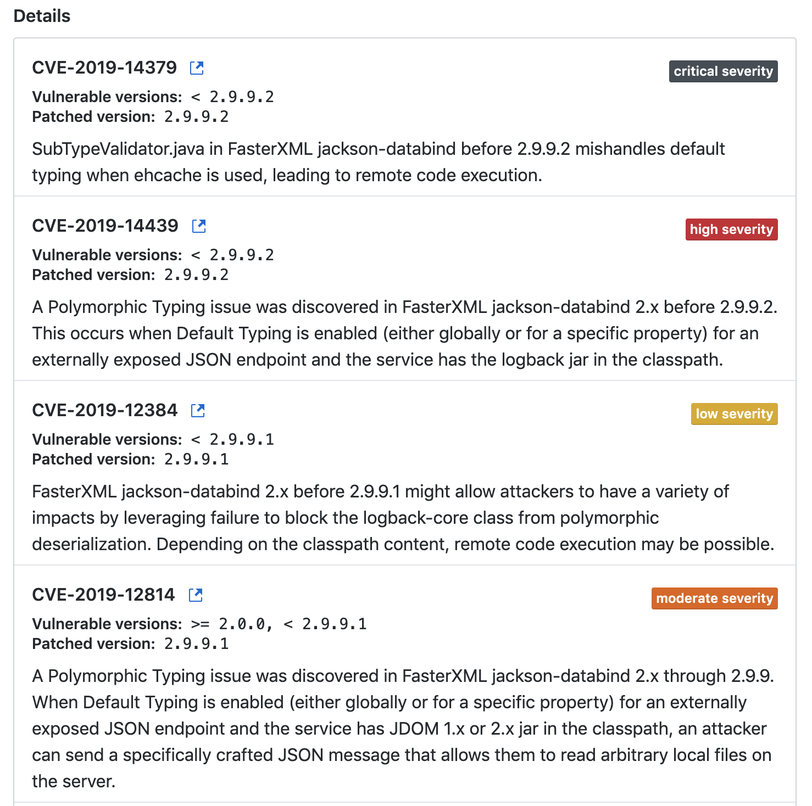

## 描述



#### Remediation

Upgrade com.fasterxml.jackson.core:jackson-databind to version 2.9.9.2 or later. For example:

```
<dependency>
  <groupId>com.fasterxml.jackson.core</groupId>
  <artifactId>jackson-databind</artifactId>
  <version>[2.9.9.2,)</version>
</dependency>
```

Always verify the validity and compatibility of suggestions with your codebase.

## 解决

更换版本

```xml
<!-- jackson json 优化缓存对象序列化 -->
<dependency>
  <groupId>com.fasterxml.jackson.core</groupId>
  <artifactId>jackson-databind</artifactId>
  <version>2.9.9.3</version>
</dependency>
```

