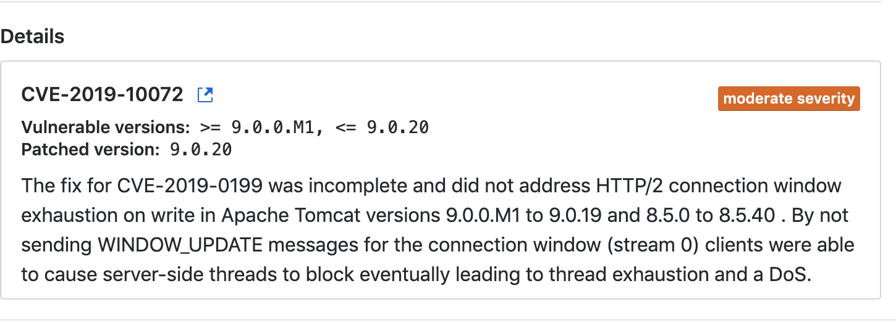

## 描述



#### Remediation

Upgrade org.apache.tomcat.embed:tomcat-embed-core to version 9.0.20 or later. For example:

```
<dependency>
  <groupId>org.apache.tomcat.embed</groupId>
  <artifactId>tomcat-embed-core</artifactId>
  <version>[9.0.20,)</version>
</dependency>
```

Always verify the validity and compatibility of suggestions with your codebase.

## 解决

更换版本

```xml
<!--解决java.io.IOException: Stream closed-->
<dependency>
  <groupId>org.apache.tomcat.embed</groupId>
  <artifactId>tomcat-embed-core</artifactId>
  <version>9.0.22</version>
</dependency>
```

