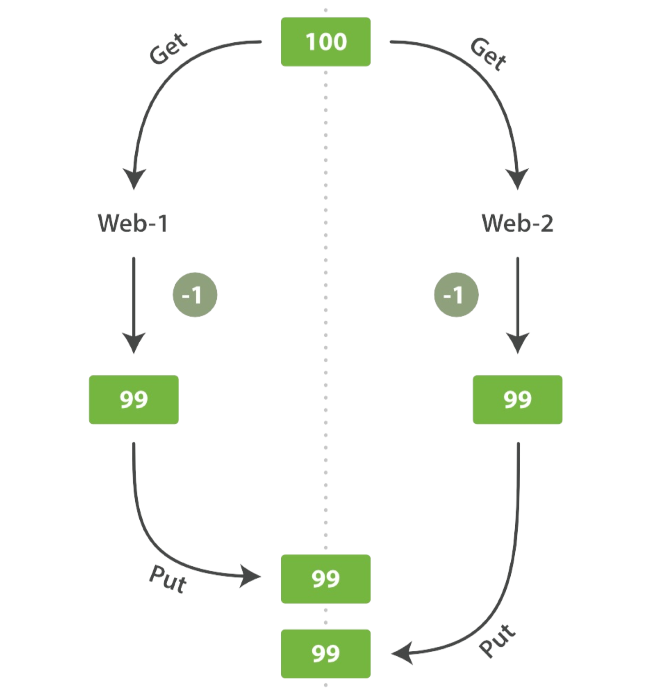

## elasticsearch处理冲突

## 描述



## 悲观并发控制（PCC）

这一点在关系数据库中被广泛使用。假设这种情况很容易发生，我们就可以阻止对这一资源 的访问。典型的例子就是当我们在读取一个数据前先锁定这一行，然后确保只有读取到数据 的这个线程可以修改这一行数据。

## 乐观并发控制（OCC）

Elasticsearch所使用的。假设这种情况并不会经常发生，也不会去阻止某一数据的访问。然而，如果基础数据在我们读取和写入的间隔中发生了变化，更新就会失败。这时候就由程序来决定如何处理这个冲突。例如，它可以重新读取新数据来进行更新，又或者它可以将这一 情况直接反馈给用户。

Elasticsearch是分布式的。当文档被创建、更新或者删除时，新版本的文档就会被复制到集群中的其他节点上。Elasticsearch即是同步的又是异步的，也就是说复制的请求被平行发送 出去，然后可能会混乱地到达目的地。这就需要一种方法能够保证新的数据不会被旧数据所覆盖。

每当有

- 索引
- put 
- 删除

的操作时，无论文档有没有变化，它的 **_version** 都会增加。

Elasticsearch使用**_version**来确保所有改变操作都被正确排序。如果一个旧版本出现在一个新版本之后，他的改变将会被忽略掉。

我们可以利用**_version** 的优点来确保我们程序修改的数据冲突不会造成数据丢失。我们可以指定 **_version** 的数字。如果数字错误，请求就是失败。

1. 获取`GET /gknoone/employee/5`，它的_version是1

   ```json
   {
     "_index" : "gknoone",
     "_type" : "employee",
     "_id" : "5",
     "_version" : 1,
     "_seq_no" : 0,
     "_primary_term" : 1,
     "found" : true,
     "_source" : {
       "first_name" : "张",
       "last_name" : "龙",
       "age" : "18",
       "about" : "I hate li si",
       "interests" : [
         "li si",
         "fly"
       ]
     }
   }
   ```

2. 更新，在_version为1的时候

   ```sh
   PUT /gknoone/employee/5?version=1
   {
       "first_name" : "赵",
       "last_name" : "虎",
       "age" : "18",
       "about" : "I hate li si",
       "interests" : [
         "li si",
         "fly"
       ]
     }
   ```

   - 结果，"_version" : 2

   ```json
   {
     "_index" : "gknoone",
     "_type" : "employee",
     "_id" : "5",
     "_version" : 2,
     "result" : "updated",
     "_shards" : {
       "total" : 2,
       "successful" : 1,
       "failed" : 0
     },
     "_seq_no" : 1,
     "_primary_term" : 1
   }
   ```

3. 再次执行2的内容`PUT /gknoone/employee/5?version=1 {...}`

   - 结果 ，返回409

   ```json
   {
     "error": {
       "root_cause": [
         {
           "type": "version_conflict_engine_exception",
           "reason": "[employee][5]: version conflict, current version [2] is different than the one provided [1]",
           "index_uuid": "j-gD7jb6STq9hFVe8tlPFA",
           "shard": "1",
           "index": "gknoone"
         }
       ],
       "type": "version_conflict_engine_exception",
       "reason": "[employee][5]: version conflict, current version [2] is different than the one provided [1]",
       "index_uuid": "j-gD7jb6STq9hFVe8tlPFA",
       "shard": "1",
       "index": "gknoone"
     },
     "status": 409
   }
   ```

所有的有关于更新或者删除文档的API都支持`_version`来使用乐观并发控制。

## 使用外部系统的版本

还有一种常见的情况就是我们还是使用其他的数据库来存储数据，而Elasticsearch只是帮我 们检索数据。这也就意味着主数据库只要发生的变更，就需要将其拷贝到Elasticsearch中。 如果多个进程同时发生，就会产生上文提到的那些并发问题。

如果你的数据库已经存在了版本号码，或者也可以代表版本的`时间戳`。这时，你就可以在Elasticsearch的查询字符串后面添加`version_type=external `来使用这些号码。版本号码必须要是大于零小于9.2e+18（Java中long的最大正值）的整数。

Elasticsearch在处理外部版本号时会与对内部版本号的处理有些不同。它不再是检 查 **_version** 是否与请求中指定的数值相同,而是检查当前的 **_version** 是否比指定的数值小。 如果请求成功，那么外部的版本号就会被存储到文档中的 **_version** 中。

外部版本号不仅可以在索引和删除请求时使用，还可以在创建时使用

```sh
PUT /gknoone/employee/5?version=1&version_type=external
{
    "first_name" : "赵",
    "last_name" : "虎",
    "age" : "18",
    "about" : "I hate li si",
    "interests" : [
      "li si",
      "fly"
    ]
  }
```

现在我们更新这个文档，并指定version为10

```sh
PUT /gknoone/employee/5?version=10&version_type=external
{
    "first_name" : "赵",
    "last_name" : "虎",
    "age" : "18",
    "about" : "I hate li si",
    "interests" : [
      "li si",
      "fly"
    ]
  }
```

