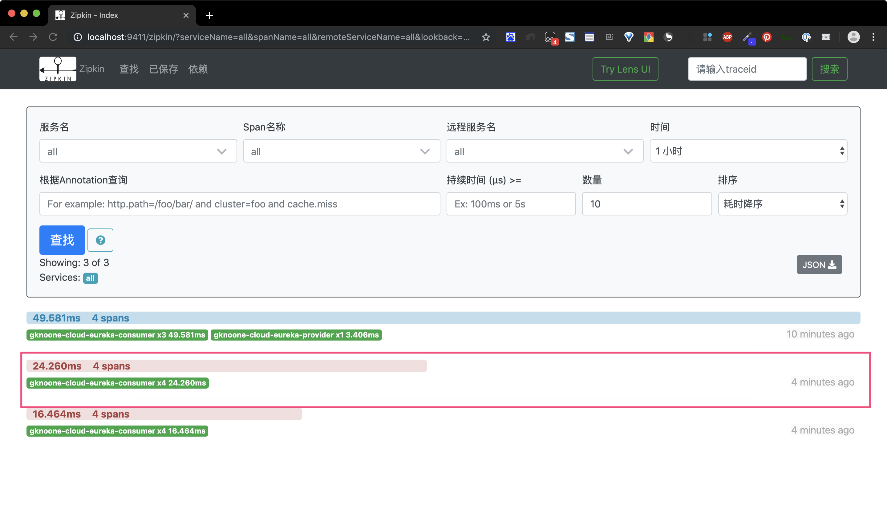
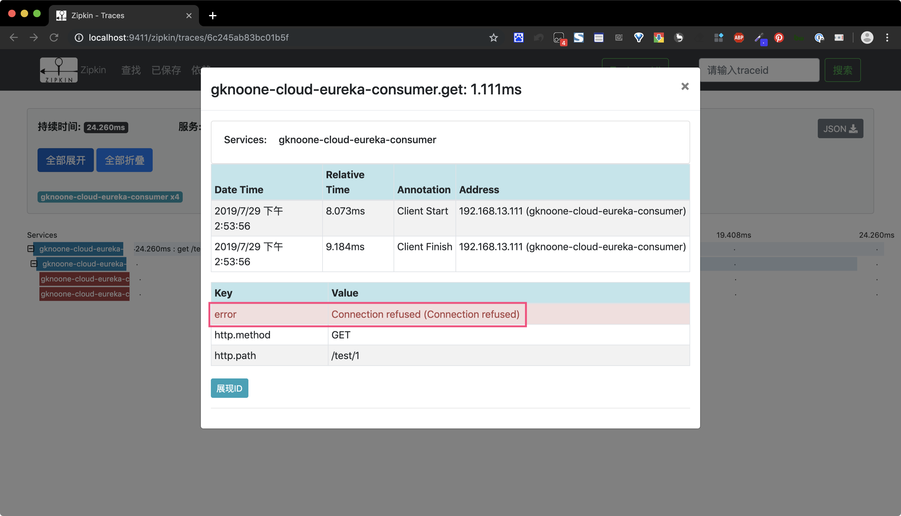
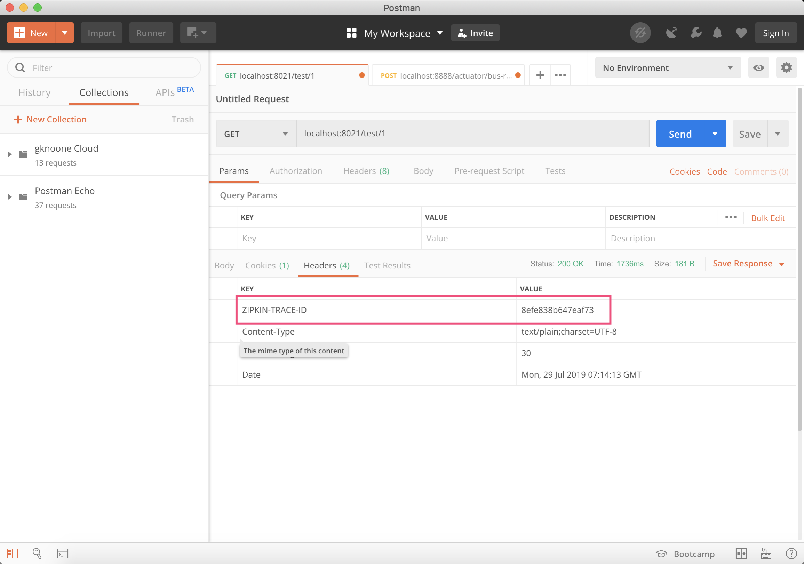
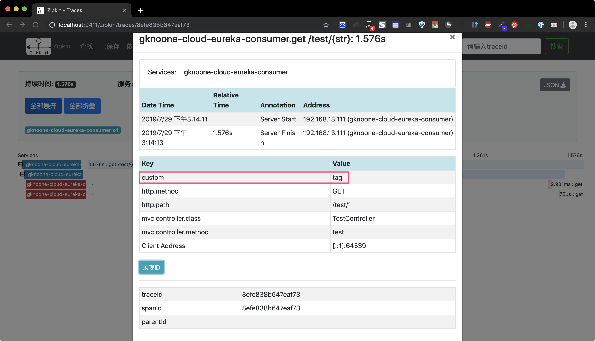

# sleuth服务跟踪

[TOC]

## 术语
- `Span`：基本工作单元，例如，在一个新建的span中发送一个RPC等同于发送一个回应请求给RPC，span通过一个64位ID唯一标识，trace以另一个64位ID表示，span还有其他数据信息，比如摘要、时间戳事件、关键值注释(tags)、span的ID、以及进度ID(通常是IP地址)
  span在不断的启动和停止，同时记录了时间信息，当你创建了一个span，你必须在未来的某个时刻停止它。

- `Trace`：一系列spans组成的一个树状结构，例如，如果你正在跑一个分布式大数据工程，你可能需要创建一个trace。
  Annotation：用来及时记录一个事件的存在，一些核心annotations用来定义一个请求的开始和结束

- `cs - Client Sent` -客户端发起一个请求，这个annotion描述了这个span的开始

- `sr - Server Received` -服务端获得请求并准备开始处理它，如果将其sr减去cs时间戳便可得到网络延迟

- `ss - Server Sent` -注解表明请求处理的完成(当请求返回客户端)，如果ss减去sr时间戳便可得到服务端需要的处理请求时间

- `cr - Client Received` -表明span的结束，客户端成功接收到服务端的回复，如果cr减去cs时间戳便可得到客户端从服务端获取回复的所有所需时间

  

  

  可视化**Span**和**Trace**将与Zipkin注释一起查看系统如下图：


## zipkin安装启动

### Docker 安装

docker启动zipkin

```bash
docker run -d -p 9411:9411 openzipkin/zipkin
```
## Java安装

```bash
curl -sSL https://zipkin.io/quickstart.sh | bash -s
java -jar zipkin.jar
```

### 验证

浏览器访问`localhost:9411`


## 集成
### 模块说明

- gknoone-cloud-eureka-consumer
- gknoone-cloud-eureka-provider
### 集成sleuth
1. 引入依赖
```xml
<dependency>
   <groupId>org.springframework.cloud</groupId>
   <artifactId>spring-cloud-starter-sleuth</artifactId>
</dependency>
```
2. 配置`application.yml`(以gknoone-cloud-eureka-consumer为例)，开启sleuth的debug日志
```yml
logging:
  level:
    root: INFO
    # 开启sleuth的debug日志
    org.springframework.cloud.sleuth: DEBUG
```
3. 用postman访问`localhost:8021/test/1`，查看日志如下
```bash
2019-07-29 11:49:05.457 DEBUG [gknoone-cloud-eureka-consumer,0efab49616141a10,afae19d7f7e0f943,false] 20103 --- [reka-provider-2] c.s.i.w.c.f.TraceLoadBalancerFeignClient : Before send
2019-07-29 11:49:05.457 DEBUG [gknoone-cloud-eureka-consumer,0efab49616141a10,afae19d7f7e0f943,false] 20103 --- [reka-provider-2] o.s.c.s.i.w.c.f.LazyTracingFeignClient   : Sending a request via tracing feign client [org.springframework.cloud.sleuth.instrument.web.client.feign.TracingFeignClient@785845fd] and the delegate [feign.Client$Default@d2a0ea1]
2019-07-29 11:49:05.457 DEBUG [gknoone-cloud-eureka-consumer,0efab49616141a10,afae19d7f7e0f943,false] 20103 --- [reka-provider-2] o.s.c.s.i.w.c.feign.TracingFeignClient   : Handled send of NoopSpan(0efab49616141a10/02bada8c807e0ef4)
2019-07-29 11:49:05.682 DEBUG [gknoone-cloud-eureka-consumer,0efab49616141a10,afae19d7f7e0f943,false] 20103 --- [reka-provider-2] o.s.c.s.i.w.c.feign.TracingFeignClient   : Handled receive of NoopSpan(0efab49616141a10/02bada8c807e0ef4)
2019-07-29 11:49:05.683 DEBUG [gknoone-cloud-eureka-consumer,0efab49616141a10,afae19d7f7e0f943,false] 20103 --- [reka-provider-2] c.s.i.w.c.f.TraceLoadBalancerFeignClient : After receive
```

其中可以看到日志内容中的`[gknoone-cloud-eureka-consumer,0efab49616141a10,afae19d7f7e0f943,false]`，
即`[appname,traceId,spanId,exportable]`。
含义如下：

- appname：服务的名称，即spring.application.name。
- traceId：整个请求的唯一ID，它标识整个请求的链路。
- spanId：基本的工作单元，发起一次远程调用就是一个span。
- exportable：决定是否导入到Zipkin。
### 集成zipkin
1. 引入依赖
```xml
<dependency>
   <groupId>org.springframework.cloud</groupId>
   <artifactId>spring-cloud-starter-zipkin</artifactId>
</dependency>
```
2. 配置`application.yml`(以gknoone-cloud-eureka-consumer为例)，添加zipkin配置
```yml
spring:
  zipkin:
    base-url: http://localhost:9411
```
### 正常服务测试
1. 重启两个模块，浏览器访问`localhost:9411`，点击依赖


2. 用postman访问`localhost:8021/test/1`，依次点击下图1、2查找，可以查找到3所示，点击3，可以看到具体到转发信息


### 异常服务测试
1. 关闭gknoone-cloud-eureka-provider
2. 用postman访问`localhost:8021/test/1`，再次点击查找


点击上图的红色异常服务

可以看出，异常的内容是`Connection refused`连接拒绝

### 优化
#### 设置抽样比例
```yml
spring:
  sleuth:
    sampler:
      # 设置抽样比例，默认0.1
      probability: 1.0
```

#### 设置自定义TracingFilter
> TracingFilter是负责处理请求和响应的组件。
> 方便调试排查问题
1. 添加自定义组件MyFilter
    - 添加自定义的标记
    - 将请求ID添加到响应头
```java
package com.gknoone.cloud.eureka.consumer.filter;

import brave.Span;
import brave.Tracer;
import org.springframework.cloud.sleuth.instrument.web.TraceWebServletAutoConfiguration;
import org.springframework.core.annotation.Order;
import org.springframework.stereotype.Component;
import org.springframework.web.filter.GenericFilterBean;

import javax.servlet.FilterChain;
import javax.servlet.ServletException;
import javax.servlet.ServletRequest;
import javax.servlet.ServletResponse;
import javax.servlet.http.HttpServletResponse;
import java.io.IOException;

/**
 * 自定义Filter，用于
 * 1.添加自定义的标记
 * 2.将请求ID添加到响应头
 * @author gknoone
 * @date 2019-07-29 15:06
 */
@Component
@Order(TraceWebServletAutoConfiguration.TRACING_FILTER_ORDER+1)
public class MyFilter extends GenericFilterBean {
    private  final Tracer tracer;

    public MyFilter(Tracer tracer) {
        this.tracer = tracer;
    }

    @Override
    public void doFilter(ServletRequest servletRequest, ServletResponse servletResponse, FilterChain filterChain) throws IOException, ServletException {
        Span currentSpan = this.tracer.currentSpan();
        if(currentSpan == null){
            filterChain.doFilter(servletRequest,servletResponse);
            return ;
        }
        ((HttpServletResponse) servletResponse).addHeader("ZIPKIN-TRACE-ID",currentSpan.context().traceIdString());
        currentSpan.tag("custom","tag");
        filterChain.doFilter(servletRequest,servletResponse);
    }
}
```
2. 用postman访问`localhost:8021/test/1`，查看Headers信息

3. 查看zipkin


#### 过滤不行跟踪的请求
```java
/**
 * 进行zipkin过滤，返回false时，不会发生到zipkin
 * @param provider SkipPatternProvider设置了很多过滤规则
 * @return HttpSampler
 */
@Bean(name = ServerSampler.NAME)
HttpSampler myHttpSampler(SkipPatternProvider provider){
    Pattern pattern = provider.skipPattern();
    return new HttpSampler() {
        @Override
        public <Req> Boolean trySample(HttpAdapter<Req, ?> httpAdapter, Req req) {
            String url = httpAdapter.path(req);
            boolean shouldSkip = pattern.matcher(url).matches();
            if(shouldSkip){
                return false;
            }
            if(url.equals("/test/1")){
                return false;
            }
            return null;
        }
    };
}
```
#### 用rabbitMq代替http发送调用链数据（高可用）
1. 引入依赖
```xml
<dependency>
    <groupId>org.springframework.amqp</groupId>
    <artifactId>spring-rabbit</artifactId>
</dependency>
```
2. 升级配置
```yml
spring:
  zipkin:
    # base-url: http://localhost:9411
    # 设置zipkin数据发送方式为rabbitmq
    sender:
      type: rabbit
  rabbitmq:
    addresses: amqp://localhost:5672
    username: guest
    password: guest
```
