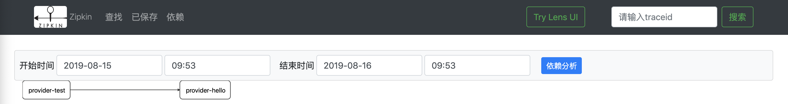
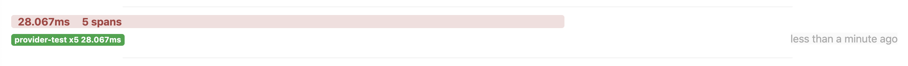
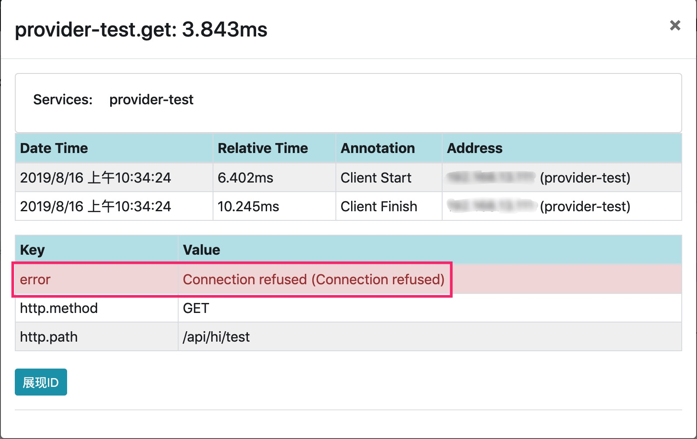
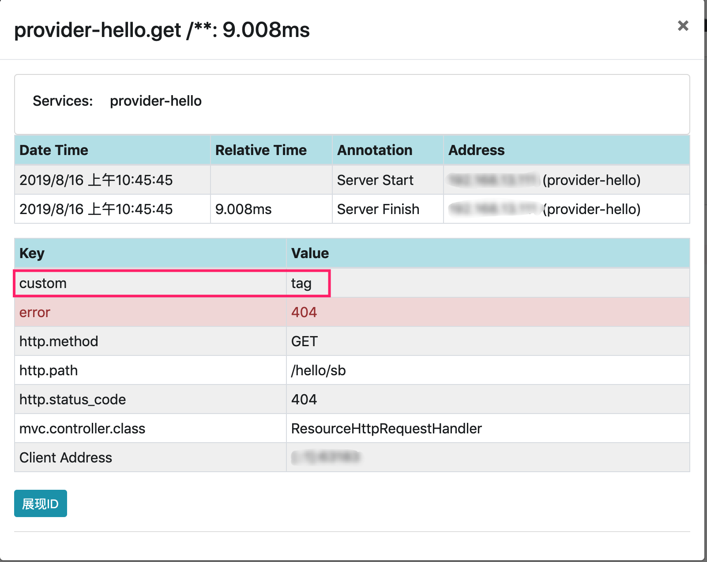
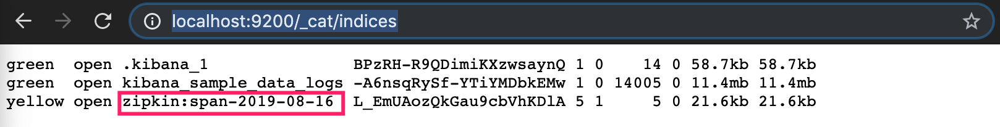
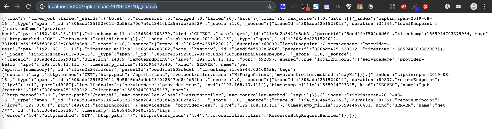

# sleuth服务跟踪

<!-- @import "[TOC]" {cmd="toc" depthFrom=2 depthTo=6 orderedList=false} -->
<!-- code_chunk_output -->

* [术语](#术语)
* [zipkin安装启动](#zipkin安装启动)
	* [Docker 安装](#docker-安装)
* [Java安装](#java安装)
	* [验证](#验证)
* [集成](#集成)
	* [模块说明](#模块说明)
	* [集成sleuth](#集成sleuth)
	* [集成zipkin](#集成zipkin)
	* [正常服务测试](#正常服务测试)
	* [异常服务测试](#异常服务测试)
	* [优化](#优化)
		* [设置抽样比例](#设置抽样比例)
		* [设置自定义TracingFilter](#设置自定义tracingfilter)
		* [过滤不想跟踪的请求](#过滤不想跟踪的请求)
		* [用rabbitMq代替http发送调用链数据（高可用）](#用rabbitmq代替http发送调用链数据高可用)
		* [用Elasticsearch存储调用数据链](#用elasticsearch存储调用数据链)

<!-- /code_chunk_output -->

## 术语
- `Span`：基本工作单元，例如，在一个新建的span中发送一个RPC等同于发送一个回应请求给RPC，span通过一个64位ID唯一标识，trace以另一个64位ID表示，span还有其他数据信息，比如摘要、时间戳事件、关键值注释(tags)、span的ID、以及进度ID(通常是IP地址)
  span在不断的启动和停止，同时记录了时间信息，当你创建了一个span，你必须在未来的某个时刻停止它。

- `Trace`：一系列spans组成的一个树状结构，例如，如果你正在跑一个分布式大数据工程，你可能需要创建一个trace。
  Annotation：用来及时记录一个事件的存在，一些核心annotations用来定义一个请求的开始和结束

- `cs - Client Sent` -客户端发起一个请求，这个annotion描述了这个span的开始

- `sr - Server Received` -服务端获得请求并准备开始处理它，如果将其sr减去cs时间戳便可得到网络延迟

- `ss - Server Sent` -注解表明请求处理的完成(当请求返回客户端)，如果ss减去sr时间戳便可得到服务端需要的处理请求时间

- `cr - Client Received` -表明span的结束，客户端成功接收到服务端的回复，如果cr减去cs时间戳便可得到客户端从服务端获取回复的所有所需时间


  可视化**Span**和**Trace**将与Zipkin注释一起查看系统如下图：


## zipkin安装启动

### Docker 安装

docker启动zipkin

```bash
docker run -d -p 9411:9411 openzipkin/zipkin
```
## Java安装

```bash
curl -sSL https://zipkin.io/quickstart.sh | bash -s
java -jar zipkin.jar
```

### 验证

浏览器访问`localhost:9411`


## 集成
### 模块说明

- Gknoone-cloud-plus-provider-hello
- gknoone-cloud-plus-provider-test
### 集成sleuth
1. 引入依赖
```xml
<dependency>
   <groupId>org.springframework.cloud</groupId>
   <artifactId>spring-cloud-starter-sleuth</artifactId>
</dependency>
```
2. 配置`application.yml`(以gknoone-cloud-eureka-consumer为例)，开启sleuth的debug日志
```yml
logging:
  level:
    root: INFO
    # 开启sleuth的debug日志
    org.springframework.cloud.sleuth: DEBUG
```
3. 用postman访问`localhost:8021/test/1`，查看日志如下
```bash
2019-07-29 11:49:05.457 DEBUG [gknoone-cloud-eureka-consumer,0efab49616141a10,afae19d7f7e0f943,false] 20103 --- [reka-provider-2] c.s.i.w.c.f.TraceLoadBalancerFeignClient : Before send
2019-07-29 11:49:05.457 DEBUG [gknoone-cloud-eureka-consumer,0efab49616141a10,afae19d7f7e0f943,false] 20103 --- [reka-provider-2] o.s.c.s.i.w.c.f.LazyTracingFeignClient   : Sending a request via tracing feign client [org.springframework.cloud.sleuth.instrument.web.client.feign.TracingFeignClient@785845fd] and the delegate [feign.Client$Default@d2a0ea1]
2019-07-29 11:49:05.457 DEBUG [gknoone-cloud-eureka-consumer,0efab49616141a10,afae19d7f7e0f943,false] 20103 --- [reka-provider-2] o.s.c.s.i.w.c.feign.TracingFeignClient   : Handled send of NoopSpan(0efab49616141a10/02bada8c807e0ef4)
2019-07-29 11:49:05.682 DEBUG [gknoone-cloud-eureka-consumer,0efab49616141a10,afae19d7f7e0f943,false] 20103 --- [reka-provider-2] o.s.c.s.i.w.c.feign.TracingFeignClient   : Handled receive of NoopSpan(0efab49616141a10/02bada8c807e0ef4)
2019-07-29 11:49:05.683 DEBUG [gknoone-cloud-eureka-consumer,0efab49616141a10,afae19d7f7e0f943,false] 20103 --- [reka-provider-2] c.s.i.w.c.f.TraceLoadBalancerFeignClient : After receive
```

其中可以看到日志内容中的`[gknoone-cloud-eureka-consumer,0efab49616141a10,afae19d7f7e0f943,false]`，
即`[appname,traceId,spanId,exportable]`。
含义如下：

- appname：服务的名称，即spring.application.name。
- traceId：整个请求的唯一ID，它标识整个请求的链路。
- spanId：基本的工作单元，发起一次远程调用就是一个span。
- exportable：决定是否导入到Zipkin。
### 集成zipkin
1. 引入依赖
```xml
<dependency>
   <groupId>org.springframework.cloud</groupId>
   <artifactId>spring-cloud-starter-zipkin</artifactId>
</dependency>
```
2. 配置`application.yml`(以gknoone-cloud-plus-provider-hello为例)，添加zipkin配置
```yml
spring:
  zipkin:
    base-url: http://localhost:9411
```
### 正常服务测试
1. 重启两个模块，浏览器访问`localhost:9411`，点击依赖


2. 用postman访问`http://localhost:8003/test/hi`，点击下图查找，可以看到具体到转发信息


3. 点击上图所示转发信息，可以查看细节

  

### 异常服务测试

1. 关闭gknoone-cloud-plus-provider-hello

2. 用postman访问`http://localhost:8003/test/hi`，再次点击查找



3. 点击查看

  

4. 点击查看，可以看到具体的BUG

   

### 优化

#### 设置抽样比例

```yml
spring:
  sleuth:
    sampler:
      # 设置抽样比例，默认0.1
      probability: 1.0
```

#### 设置自定义TracingFilter
> TracingFilter是负责处理请求和响应的组件。
> 方便调试排查问题
1. 添加自定义组件MyFilter
    - 添加自定义的标记
    - 将请求ID添加到响应头
```java
package com.gknoone.cloud.plus.microservices.filter;

import brave.Span;
import brave.Tracer;
import org.springframework.cloud.sleuth.instrument.web.TraceWebServletAutoConfiguration;
import org.springframework.core.annotation.Order;
import org.springframework.stereotype.Component;
import org.springframework.web.filter.GenericFilterBean;

import javax.servlet.FilterChain;
import javax.servlet.ServletException;
import javax.servlet.ServletRequest;
import javax.servlet.ServletResponse;
import javax.servlet.http.HttpServletResponse;
import java.io.IOException;

/**
 * 处理请求和响应的组件
 * 自定义Filter，用于
 * 1.添加自定义的标记
 * 2.将请求ID添加到响应头
 * @author gknoone
 * @date 2019-08-16 09:45
 */
@Component
@Order(TraceWebServletAutoConfiguration.TRACING_FILTER_ORDER+1)
public class MyTracingFilter extends GenericFilterBean {
    private  final Tracer tracer;

    public MyTracingFilter(Tracer tracer) {
        this.tracer = tracer;
    }

    @Override
    public void doFilter(ServletRequest servletRequest, ServletResponse servletResponse, FilterChain filterChain) throws IOException, ServletException {
        Span currentSpan = this.tracer.currentSpan();
        if(currentSpan == null){
            filterChain.doFilter(servletRequest,servletResponse);
            return ;
        }
        ((HttpServletResponse) servletResponse).addHeader("ZIPKIN-TRACE-ID",currentSpan.context().traceIdString());
        currentSpan.tag("custom","tag");
        filterChain.doFilter(servletRequest,servletResponse);
    }
}

```
2. 用postman访问`http://localhost:8002/hello/sb`，查看Headers信息

3. 查看zipkin


#### 过滤不想跟踪的请求

```java
/**
 * 进行zipkin过滤，返回false时，不会发生到zipkin
 * @param provider SkipPatternProvider设置了很多过滤规则
 * @return HttpSampler
 */
@Bean(name = ServerSampler.NAME)
HttpSampler myHttpSampler(SkipPatternProvider provider){
    Pattern pattern = provider.skipPattern();
    return new HttpSampler() {
        @Override
        public <Req> Boolean trySample(HttpAdapter<Req, ?> httpAdapter, Req req) {
            String url = httpAdapter.path(req);
            boolean shouldSkip = pattern.matcher(url).matches();
            if(shouldSkip){
                return false;
            }
            if(url.equals("/test/1")){
                return false;
            }
            return null;
        }
    };
}
```
#### 用rabbitMq代替http发送调用链数据（高可用）

1. 引入依赖
```xml
<dependency>
    <groupId>org.springframework.amqp</groupId>
    <artifactId>spring-rabbit</artifactId>
</dependency>
```
2. 升级配置
```yml
spring:
  zipkin:
    # base-url: http://localhost:9411
    # 设置zipkin数据发送方式为rabbitmq
    sender:
      type: rabbit
  rabbitmq:
    addresses: amqp://localhost:5672
    username: gknoone
    password: gk123456
```
3. 重新启动zipkin

```bash
java -DRABBIT_ADDRESSES=127.0.0.1:5672 -DRABBIT_USER=guest -DRABBIT_PASSWORD=guest -jar zipkin.jar
```


#### 用Elasticsearch存储调用数据链

1. 重新启动zipkin

```bash
java -DSTORAGE_TYPE=elasticsearch -DES_HOSTS=127.0.0.1:9200 -DRABBIT_ADDRESSES=127.0.0.1:5672 -DRABBIT_USER=guest -DRABBIT_PASSWORD=guest -jar zipkin.jar
```

2. 访问[http://localhost:9200/_cat/indices](http://localhost:9200/_cat/indices)，结果如下所示



3. 访问[http://localhost:9200/zipkin:span-2019-08-16/_search](http://localhost:9200/zipkin:span-2019-08-16/_search)

```http
http://localhost:9200/${索引名称}/_search
```



```json
{
    "took": 3,
    "timed_out": false,
    "_shards": {
        "total": 5,
        "successful": 5,
        "skipped": 0,
        "failed": 0
    },
    "hits": {
        "total": 5,
        "max_score": 1.0,
        "hits": [
            {
                "_index": "zipkin:span-2019-08-16",
                "_type": "span",
                "_id": "306adc4251529012-2b563a70c7e4c12410b2a5a9db8a5539",
                "_score": 1.0,
                "_source": {
                    "traceId": "306adc4251529012",
                    "duration": 34146,
                    "localEndpoint": {
                        "serviceName": "provider-test",
                        "ipv4": "192.168.13.111"
                    },
                    "timestamp_millis": 1565944703379,
                    "kind": "CLIENT",
                    "name": "get",
                    "id": "21c8e2a342fe8eb3",
                    "parentId": "5eed9fef502e6d6f",
                    "timestamp": 1565944703379934,
                    "tags": {
                        "http.method": "GET",
                        "http.path": "/api/hi/test"
                    }
                }
            },
            {
                "_index": "zipkin:span-2019-08-16",
                "_type": "span",
                "_id": "306adc4251529012-731bd11b591ff5fd398682e708d3a8c9",
                "_score": 1.0,
                "_source": {
                    "traceId": "306adc4251529012",
                    "duration": 60039,
                    "localEndpoint": {
                        "serviceName": "provider-test",
                        "ipv4": "192.168.13.111"
                    },
                    "timestamp_millis": 1565944703362,
                    "name": "hystrix",
                    "id": "5eed9fef502e6d6f",
                    "parentId": "306adc4251529012",
                    "timestamp": 1565944703362907
                }
            },
            {
                "_index": "zipkin:span-2019-08-16",
                "_type": "span",
                "_id": "306adc4251529012-8f7c68db1756c5b8fbfa561ea8b48b05",
                "_score": 1.0,
                "_source": {
                    "traceId": "306adc4251529012",
                    "duration": 14379,
                    "remoteEndpoint": {
                        "ipv4": "192.168.13.111",
                        "port": 49289
                    },
                    "shared": true,
                    "localEndpoint": {
                        "serviceName": "provider-hello",
                        "ipv4": "192.168.13.111"
                    },
                    "timestamp_millis": 1565944703400,
                    "kind": "SERVER",
                    "name": "get /api/hi/{somebody}",
                    "id": "21c8e2a342fe8eb3",
                    "parentId": "5eed9fef502e6d6f",
                    "timestamp": 1565944703400636,
                    "tags": {
                        "custom": "tag",
                        "http.method": "GET",
                        "http.path": "/api/hi/test",
                        "mvc.controller.class": "HiFeignClient",
                        "mvc.controller.method": "sayHi"
                    }
                }
            },
            {
                "_index": "zipkin:span-2019-08-16",
                "_type": "span",
                "_id": "306adc4251529012-5e5846bb3adcb13f092807ed844d52ba",
                "_score": 1.0,
                "_source": {
                    "traceId": "306adc4251529012",
                    "duration": 80837,
                    "remoteEndpoint": {
                        "ipv6": "::1",
                        "port": 49287
                    },
                    "localEndpoint": {
                        "serviceName": "provider-test",
                        "ipv4": "192.168.13.111"
                    },
                    "timestamp_millis": 1565944703345,
                    "kind": "SERVER",
                    "name": "get /test/hi",
                    "id": "306adc4251529012",
                    "timestamp": 1565944703345167,
                    "tags": {
                        "http.method": "GET",
                        "http.path": "/test/hi",
                        "mvc.controller.class": "TestController",
                        "mvc.controller.method": "sayHi"
                    }
                }
            },
            {
                "_index": "zipkin:span-2019-08-16",
                "_type": "span",
                "_id": "1d46f364e4f57166-633263dace20472f83b4098862fe6731",
                "_score": 1.0,
                "_source": {
                    "traceId": "1d46f364e4f57166",
                    "duration": 91351,
                    "remoteEndpoint": {
                        "ipv4": "127.0.0.1",
                        "port": 49282
                    },
                    "localEndpoint": {
                        "serviceName": "provider-test",
                        "ipv4": "192.168.13.111"
                    },
                    "timestamp_millis": 1565944696401,
                    "kind": "SERVER",
                    "name": "get /**",
                    "id": "1d46f364e4f57166",
                    "timestamp": 1565944696401754,
                    "tags": {
                        "error": "404",
                        "http.method": "GET",
                        "http.path": "/",
                        "http.status_code": "404",
                        "mvc.controller.class": "ResourceHttpRequestHandler"
                    }
                }
            }
        ]
    }
}
```
