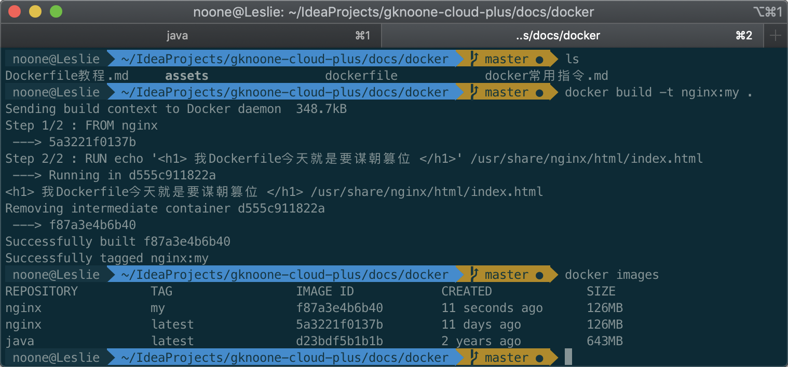

# Dockerfile教程
<!-- @import "[TOC]" {cmd="toc" depthFrom=2 depthTo=6 orderedList=false} -->
<!-- code_chunk_output -->

* [使用dockerfile构建镜像](#使用dockerfile构建镜像)

<!-- /code_chunk_output -->

## 使用dockerfile构建镜像

1. 启动nginx

   ```shell
   # -d 在后台运行容器并打印容器ID
   # -p 将容器的端口发布到主机
   docker run -d -p 91:80 nginx
   ```

2. 新建`dockerfile`文件

   ```dockerfile
   FROM nginx
   RUN echo '<h1> 我Dockerfile今天就是要谋朝篡位 </h1>' > /usr/share/nginx/html/index.html
   ```

3. 在`dockerfile`所在目录下

   ```bash
   # -t 设置标签，格式为name:tag，其中tag可选
   # . 用于路径参数传递表示当前路径
   docker build -t nginx:my .
   ```

   

4. 启动docker容器

   ```shell
   docker run -d -p 92:80 nginx:my
   ```
