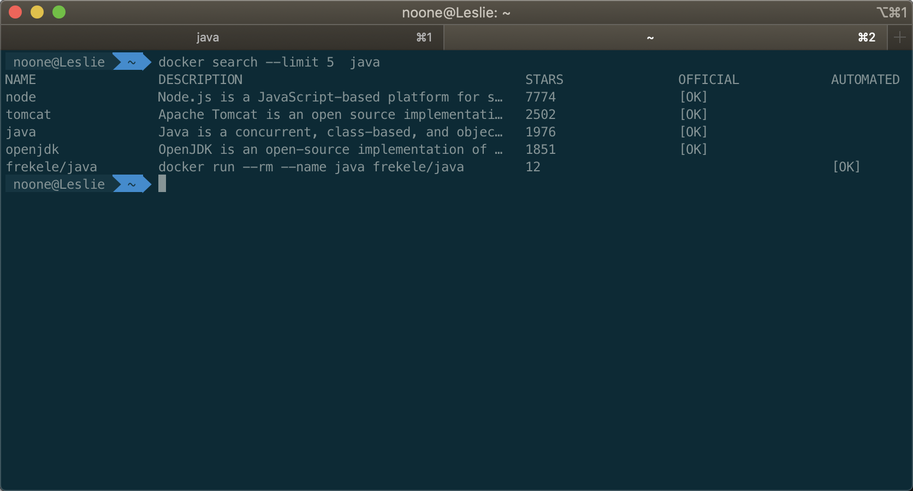
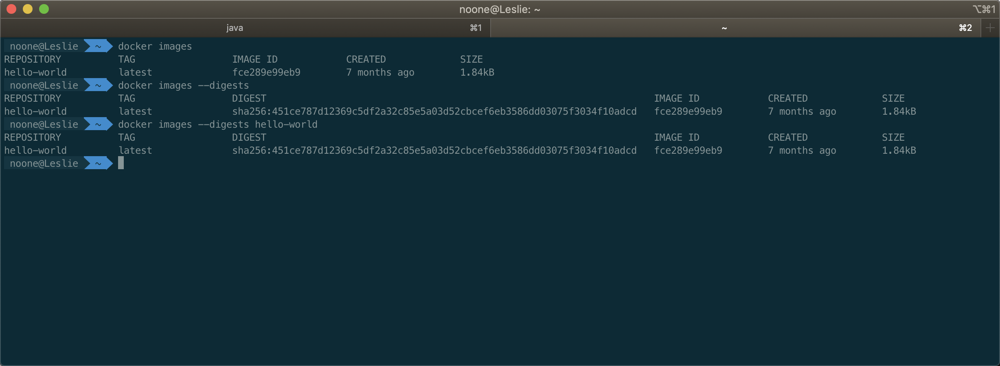

# docker常用指令

<!-- @import "[TOC]" {cmd="toc" depthFrom=2 depthTo=6 orderedList=false} -->
<!-- code_chunk_output -->

* [docker 镜像常用指令](#docker-镜像常用指令)
	* [搜索镜像docker search](#搜索镜像docker-search)
	* [下载镜像 docker pull](#下载镜像-docker-pull)
	* [列出镜像 docker images](#列出镜像-docker-images)
	* [删除本地镜像 docker rmi](#删除本地镜像-docker-rmi)
	* [保存镜像 docker save](#保存镜像-docker-save)
	* [加载镜像 docker load](#加载镜像-docker-load)
	* [通过Dockerfile构建镜像 docker build](#通过dockerfile构建镜像-docker-build)
* [Docker 容器常用指令](#docker-容器常用指令)
	* [新建并启动容器 docker run](#新建并启动容器-docker-run)
	* [列出容器 docker ps](#列出容器-docker-ps)
	* [停止容器 docker stop](#停止容器-docker-stop)
	* [强制停止容器 docker kill](#强制停止容器-docker-kill)
	* [启动已停止的容器 docker start](#启动已停止的容器-docker-start)
	* [重启容器 docker restart](#重启容器-docker-restart)
	* [进入容器 docker attach/docker exec](#进入容器-docker-attachdocker-exec)
		* [docker attch方式(不推荐)](#docker-attch方式不推荐)
		* [使用docker exec](#使用docker-exec)
	* [删除容器 docker rm](#删除容器-docker-rm)
	* [导出容器 docker export](#导出容器-docker-export)
	* [导入容器 docker import](#导入容器-docker-import)

<!-- /code_chunk_output -->

## docker 镜像常用指令

### 搜索镜像docker search

```bash
docker search [OPTIONS] TERM
```
- `docker search`命令参数

| Name,shorthand | Default |             Description              |
| :------------: | :-----: | :----------------------------------: |
| `--automated`  |  False  |     [已废弃]只列出自动构建的镜像     |
| `--filter,-f`  |         |         根据指定条件过滤结果         |
|   `--limit`    |   25    |           搜索结果最大条数           |
|  `--no-trunc`  |  False  |      不截断输出，显示完整的输出      |
|  `--stars,-s`  |    0    | [已废弃]只展示Star不低于该数值的结果 |



其中：

- name：镜像仓库名称
- description：描述
- start：收藏数
- official：是否为官方仓库
- automated：是否自动构建镜像仓库

### 下载镜像 docker pull
```bash
docker pull [OPTIONS] NAME[:TAG|@DIGEST]
```
- `docker pull`命令参数

| Name,shorthand | Default |            Description             |
| :------------: | :-----: | :--------------------------------: |
| `--all-tags,-a`  |  False  |    下载所有标签的镜像    |
| `--disable-content-trust`  | True |忽略镜像的校验|

### 列出镜像 docker images
```bash
docker images [OPTIONS] [Repository[:TAG]]
```
- `docker images`命令参数

| Name,shorthand | Default |            Description             |
| :------------: | :-----: | :--------------------------------: |
| `--all,-a`  |  False  |    列出本地所有镜像(包括中间镜像层，默认过滤中间镜像层)    |
| `--digests`  | False |显示摘要信息|
| `--filter,-f`  |  |显示满足条件的镜像|
| `--format`  |  |通过Go语言模板文件显示镜像|
| `--no-trunc`  | False |不截断输出，显示完整的镜像信息|
| `--quiet,-q`  | False |只显示镜像ID|



### 删除本地镜像 docker rmi
```bash
docker rmi [OPTIONS] IMAGE [IMAGE ...]
```
- `docker rmi`命令参数

| Name,shorthand | Default |            Description             |
| :------------: | :-----: | :--------------------------------: |
| `--force,-f`  |  False  |    强制删除    |
| `--no-prune`  | False |不移除该镜像的过程镜像，默认移除|
- 示例
```bash
# 删除指定名称的镜像
docker rmi hello-world
# 删除所有镜像
docker rmi -f $(docker images)
```

### 保存镜像 docker save

```bash
docker save [OPTIONS] IMAGE [IMAGE ...]
```
- `docker save`命令参数

| Name,shorthand | Default |            Description             |
| :------------: | :-----: | :--------------------------------: |
| `--output,-o`  |    |    输出到文件，而非标准输出    |

- 示例
```bash
# 将busybox保存为busybox.tar
docker save busybox > busybox.tar
docker save --output busybox.tar busybox
```

### 加载镜像 docker load

```bash
docker load [OPTIONS]
```
- `docker load`命令参数

| Name,shorthand | Default |            Description             |
| :------------: | :-----: | :--------------------------------: |
| `--input,-i`  |    |    从文件加载，而非标准输入    |
| `--quiet,-q`  |  False  |    静默加载   |

- 示例
```bash
# 从busybox.tar加载镜像
docker load < busybox.tar
docker load --input busybox.tar
```

### 通过Dockerfile构建镜像 docker build
```bash
docker build [OPTIONS] PATH | URL | -
```
- `docker build`命令参数

| Name,shorthand | Default |            Description             |
| :------------: | :-----: | :--------------------------------: |
| `--add-host`  |    |  添加自定义从host到IP的映射，格式为(host:ip)  |
| `--build-arg` |    | 设置构建时的变量 |
| `--cache-from` |    | 作为缓存源的镜像 |
| `--cgroup-parent` |    | 为容器指定可选的父cgroup |
| `--compress` | false | 使用gzip压缩构建上下文 |
| `--cpu-period` | 0 | 限制CPU CFS（Completely Fair Scheduler）周期 |
| `--cpu-quota` | 0 | 限制CPU CFS（Completely Fair Scheduler）配额 |
| `--cpu-shares,-c` | 0 | CPU使用权重（相对权重） |
| `--cpuset-cpus` |    | 指定允许执行的CPU（0-3,0,1） |
| `--cpuset-mems` |    | 指定允许执行的内存（0-3,0,1） |
| `--disable-content-trust` | true | 忽略校验 |
| `--file,-f` |    | 指定Dockerfile的名称，默认是PATH/Dockerfile |
| `--force-rm` | false | 删除中间容器 |
| `--iidfile` |    | 将镜像ID写到文件中 |
| `--isolation` |    | 指定容器隔离技术 |
| `--label` |    | 为镜像设置元数据 |
| `--memory,-m` | 0 | 设置内存限制 |
| `--memory-swap` | 0 | 设置swap的最大内存为内存+swap；<br/>如果设置为-1表示不限制swap |
| `--network` | default | 在构建期间设置RUN指令的网络模式 |
| `--no-cache` | false | 构建镜像过程中不使用缓存 |
| `--pull` | false | 总是尝试去下载更新版本的镜像 |
| `--quiet,-q` | false | 静默模式，构建成功后只输出镜像ID |
| `-rm` | true | 构建成功后立即删除中间容器 |
| `--security-opt` |    | 安全选项 |
| `--shm-size` | 0 | 指定/dev/shm目录的大小 |
| `--squash` | false | [实验]将构建的层压缩成一个新的层 |
| `--stream` |  | [实验]连接到服务器的流，用于协商构建上下文 |
| `--tag,-t` |    | 设置标签，格式为name:tag，其中tag可选 |
| `--target` |    | 设置构建时的目标构建阶段 |
| `--ulimit` |    | Ulimit选项 |

- 示例
```bash
docker build -t itmuch/some-repo:some-tag
```

## Docker 容器常用指令

### 新建并启动容器 docker run
```bash
docker run [OPTIONS] IMAGE [COMMAND] [ARG...]
```
- `docker run`命令常用参数

| Name,shorthand | Default |            Description             |
| :------------: | :-----: | :--------------------------------: |
| `--detach , -d` | | 在后台运行容器并打印容器ID |
| `--publish , -p` | | 将容器的端口发布到主机,有4种格式：<br/>ip:hostPort:containerPort<br/>ip::containerPort<br/>hostPort:containerPort<br/>containerPort |
| `--publish-all , -P` | |将所有公开的端口发布到随机端口 |
| `--network` | | 指定网络模式，4种可选参数：<br/>`--network=bridge`：默认选项，表示连接到默认网桥<br/>`--network=host`：容器使用宿主机的网络<br/>`--network=container:NAME_or_ID`：告诉Docker让新建的容器使用已有容器的网络配置<br/>`--network=none`：不配置该容器的网络，用户可自定义网络的配置 |
- 详细参数

  [https://docs.docker.com/engine/reference/commandline/run/](https://docs.docker.com/engine/reference/commandline/run/)

- 示例
```bash
docker run java /bin/echo 'Hello World'
# 访问http://Docker宿主机IP:91/
docker run -d -p 91:80 nginx
```
### 列出容器 docker ps
```bash
docker ps [OPTIONS]
```
- `docker ps`命令参数

| Name,shorthand | Default |            Description             |
| :------------: | :-----: | :--------------------------------: |
| `--all , -a` | | 显示所有容器（默认显示运行） |
| `--filter , -f` | | 根据提供的条件过滤输出 |
| `--format` | | 使用Go模板打印容器 |
| `--last , -n` | -1 | 显示最近创建的n个容器（包括所有状态） |
| `--latest , -l` | false | 显示最近创建的容器（包括所有状态） |
| `--no-trunc` |false |  不要截断输出 |
| `--quiet , -q` | false | 静默模式，仅显示容器ID |
| `--size , -s` | false |显示总文件大小  |

- 示例
```bash
docker ps
```

### 停止容器 docker stop
```bash
docker stop [OPTIONS] CONTAINER [CONTAINER...]
```
- `docker stop`命令参数

| Name,shorthand | Default |            Description             |
| :------------: | :-----: | :--------------------------------: |
| `--time , -t` | 10 | 在杀死之前等待停止的秒数 |

- 示例
```bash
docker stop 10cad88392f3
```
### 强制停止容器 docker kill
```bash
docker kill [OPTIONS] CONTAINER [CONTAINER...]
```
- `docker kill`命令参数

| Name,shorthand | Default |            Description             |
| :------------: | :-----: | :--------------------------------: |
| `--signal , -s` | KILL | 向容器发送一个信号 |

- 示例
```bash
docker kill 10cad88392f3
```

### 启动已停止的容器 docker start

```bash
docker kill [OPTIONS] CONTAINER [CONTAINER...]
```
- `docker start`命令参数

| Name,shorthand | Default |            Description             |
| :------------: | :-----: | :--------------------------------: |
| `--attach , -a` | false | 连接STDOUT / STDERR并转发信号 |
| `--checkpoint` |  | [实验]从该检查点还原 |
| `--checkpoint-dir` |  | [实验]使用自定义的检查点存储目录 |
| `--detach-keys` |  | 覆盖断开容器的关键顺序 |
| `--interactive , -i` |  | 连接容器的STDIN |

- 示例
```bash
docker start 10cad88392f3
```

### 重启容器 docker restart
```bash
docker restart [OPTIONS] CONTAINER [CONTAINER...]
```
- `docker restart`命令参数

| Name,shorthand | Default |            Description             |
| :------------: | :-----: | :--------------------------------: |
| `--time , -t` | 10 | 关闭容器前等待的时间，单位是s |

- 示例
```bash
docker restart 10cad88392f3
```
### 进入容器 docker attach/docker exec
#### docker attch方式(不推荐)
```bash
docker attach [OPTIONS] CONTAINER
```
- `docker attach`命令参数

| Name,shorthand | Default |            Description             |
| :------------: | :-----: | :--------------------------------: |
| `--detach-keys	` |  | 覆盖断开容器的关键顺序 |
| `--no-stdin	` |  | 不要附上STDIN |
| `--sig-proxy	` | true  | 代理收到所有进程的信号 |

- 示例
```bash
docker attach 10cad88392f3
```
#### 使用docker exec

```bash
docker exec [OPTIONS] CONTAINER COMMAND [ARG...]
```
- `docker exec`命令参数

| Name,shorthand | Default |            Description             |
| :------------: | :-----: | :--------------------------------: |
| `--detach , -d` |  | 分离模式：在后台运行命令 |
| `--detach-keys` |  | 覆盖用于分离容器的键序列 |
| `--env , -e` |  | 设置环境变量 |
| `--interactive , -i` |  | 即使没有连接，也要保持STDIN打开 |
| `--privileged` |  | 为命令提供扩展权限 |
| `--tty , -t` |  | 分配伪TTY |
| `--user , -u` |  | 用户名或UID（格式：<name | uid> [：<group | gid>]） |
| `--workdir , -w` |  | 容器内的工作目录 |

- 示例
```bash
docker exec -it 4b7bd735e7d6 /bin/bash
```

### 删除容器 docker rm

```bash
docker rm [OPTIONS] CONTAINER [CONTAINER...]
```
- `docker rm`命令参数

| Name,shorthand | Default |            Description             |
| :------------: | :-----: | :--------------------------------: |
| `--force , -f` |  | 强制删除正在运行的容器（使用SIGKILL） |
| `--link , -l` |  | 删除指定的链接 |
| `--volumes , -v` |  | 删除与容器关联的卷 |

- 示例
```bash
# 删除容器，只能删除已经停止的容器
docker rm 10cad88392f3
# 删除所有容器
docker rm -f $(docker ps -a -q)
```

### 导出容器 docker export

```bash
docker export [OPTIONS] CONTAINER
```
- `docker export`命令参数

| Name,shorthand | Default |            Description             |
| :------------: | :-----: | :--------------------------------: |
| `--output , -o` |  | 写入文件，而不是STDOUT |

- 示例
```bash
# 将red_panda容器导出成latest.tar文件
docker export red_panda > latest.tar
docker export --output="latest.tar" red_panda
```

### 导入容器 docker import
```bash
docker import [OPTIONS] file|URL|- [REPOSITORY[:TAG]]
```
- `docker import`命令参数

| Name,shorthand | Default |            Description             |
| :------------: | :-----: | :--------------------------------: |
| `--change , -c` |  | 	将Dockerfile指令应用于创建的映像|
| `--message , -m` |  | 	为导入的图像设置提交消息|
| `--platform` |  | [实验]如果服务器具有多平台功能，则设置平台|

- 示例
```bash
# 从本地目录导入
sudo tar -c . | docker import - exampleimagedir
```
