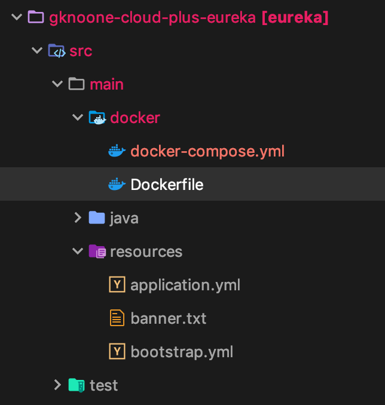
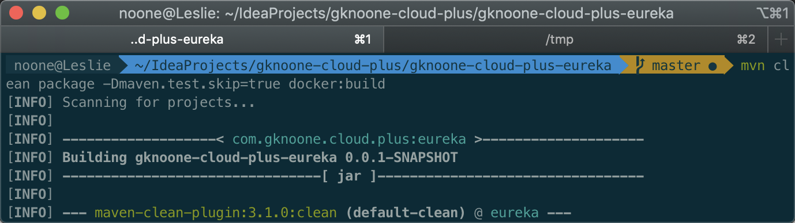

# docker单机部署eureka

## 说明

单机部署如果主机挂了，其实达不到高可用，只是为了模拟docker部署eureka

## 部署

1. 引入插件

```xml
<properties>
  <java.version>1.8</java.version>
  <docker.image.prefix>uyaba-cloud</docker.image.prefix>
</properties>
<build>
  <plugins>
    <plugin>
      <groupId>org.springframework.boot</groupId>
      <artifactId>spring-boot-maven-plugin</artifactId>
    </plugin>
    <plugin>
      <groupId>com.spotify</groupId>
      <artifactId>docker-maven-plugin</artifactId>
      <version>1.2.0</version>
      <!-- 有该配置mvn clean package -Dmaven.test.skip=true -->
      <!-- 无该配置mvn clean package -Dmaven.test.skip=true docker:build -->
      <executions>
        <execution>
          <id>build-image</id>
          <!--执行mvn package命令的时候自动执行mvn docker:build-->
          <phase>package</phase>
          <goals>
            <goal>build</goal>
          </goals>
        </execution>
      </executions>
      <configuration>
        <!-- 镜像名称 -->
        <imageName>${docker.image.prefix}/${project.artifactId}:${project.version}</imageName>
        <!-- 指定Dockerfile所在路径 -->
        <dockerDirectory>${project.basedir}/src/main/docker</dockerDirectory>
        <resources>
          <resource>
            <targetPath>/</targetPath>
            <!-- 指定需要复制的根目录，${project.build.directory}表示target目录 -->
            <directory>${project.build.directory}</directory>
            <!-- 用于指定需要复制的文件 ${project.build.finalName}.jar指打包后的jar文件包-->
            <include>${project.build.finalName}.jar</include>
          </resource>
        </resources>
      </configuration>
    </plugin>
  </plugins>
</build>
```

2. 在`src/main/docker`目录下，新建Dockerfile文件，位置如下：

​       s

   ```dockerfile
#基于哪个镜像
FROM java:8

# 将本地文件夹挂载到当前容器
VOLUME /tmp

# 拷贝文件到容器，也可以直接写成ADD chu-eureka-0.0.1-SNAPSHOT.jar /app.jar
ADD eureka-0.0.1-SNAPSHOT.jar app.jar

RUN bash -c 'touch /app.jar'

#环境变量 设置上海时区
ENV TZ=Asia/Shanghai

RUN ln -snf /usr/share/zoneinfo/$TZ /etc/localtime && echo $TZ > /etc/timezone

# 开放8111端口
EXPOSE 8111
# 开放8112端口
EXPOSE 8112

# 配置容器启动后执行的命令
ENTRYPOINT ["java","-Djava.security.egd=file:/dev/./urandom","-jar","/app.jar"]
   ```

3. 构建镜像

   ```sh
   # 有phase配置
   mvn clean package -Dmaven.test.skip=true
   # 无phase配置
   mvn clean package -Dmaven.test.skip=true docker:build
   ```

   

   结果：

   

4. 查看镜像

   

## 使用docker-compose部署

1. docker-compose.yml

   ```yml
   version: "3"
   services:
     peer1:      # 默认情况下，其他服务可以使用服务名称连接到该服务。因此，对于peer2的节点，它需要连接http://peer1:8111/eureka/，因此需要配置该服务的名称是peer1。
       image: uyaba-cloud/eureka:0.0.1-SNAPSHOT
       container_name: eureka-peer1
       networks:
         - eureka-net
       ports:
         - "8111:8111"
       environment:
         - spring.profiles.active=peer1
     peer2:
       image: uyaba-cloud/eureka:0.0.1-SNAPSHOT
       container_name: eureka-peer2
       hostname: peer2
       networks:
         - eureka-net
       ports:
         - "8112:8112"
       environment:
         - spring.profiles.active=peer2
   networks:
     eureka-net:
       driver: bridge
   ```

2. 运行

   ```sh
   docker-compose up -d
   ```

   

3. 关闭

   ```sh
   docker-compose down
   ```
