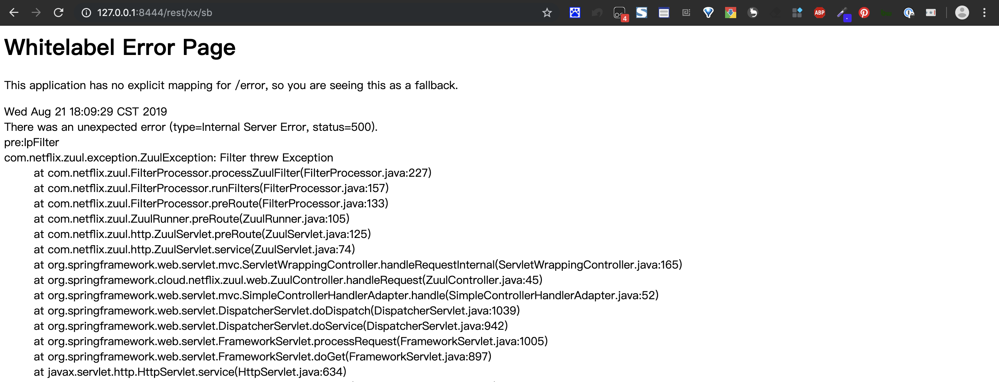
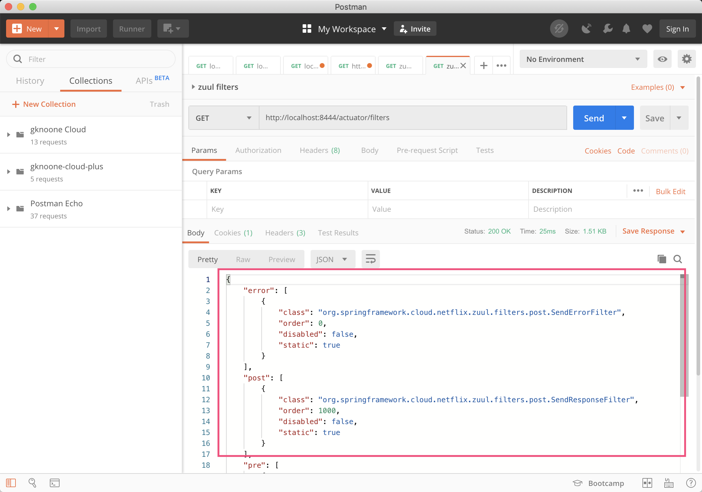
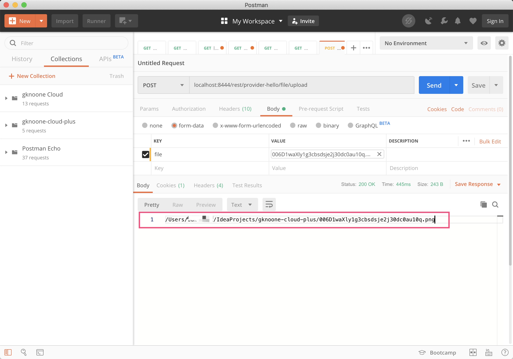
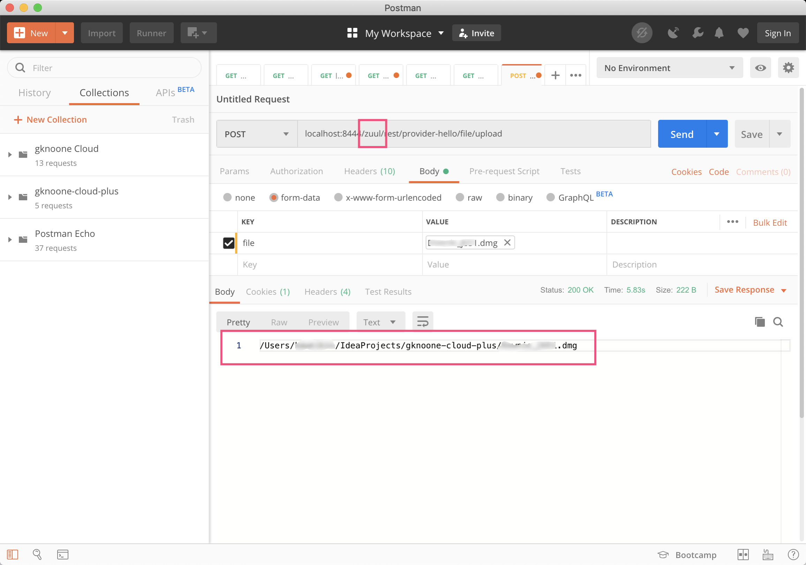

# 网关zuul

<!-- @import "[TOC]" {cmd="toc" depthFrom=2 depthTo=6 orderedList=false} -->
<!-- code_chunk_output -->

* [Quick Start](#quick-start)
* [集成Eureka](#集成eureka)
* [Zuul路由配置](#zuul路由配置)
* [Zuul过滤器讲解](#zuul过滤器讲解)
	* [过滤器类型](#过滤器类型)
	* [请求的生命周期](#请求的生命周期)
	* [使用过滤器](#使用过滤器)
	* [过滤器禁用](#过滤器禁用)
	* [过滤器中传递数据](#过滤器中传递数据)
	* [过滤器拦截请求](#过滤器拦截请求)
	* [过滤器中Error处理](#过滤器中error处理)
* [容错与回退](#容错与回退)
	* [容错机制](#容错机制)
		* [场景模拟](#场景模拟)
		* [解决](#解决)
	* [回退机制](#回退机制)
* [优化](#优化)
	* [/routes端点显示所有路由](#routes端点显示所有路由)
	* [/filters端点返回过滤器信息](#filters端点返回过滤器信息)
	* [文件上传](#文件上传)
	* [请求响应信息输出](#请求响应信息输出)
		* [Zuul自带debug](#zuul自带debug)
		* [自定义过滤器获取](#自定义过滤器获取)
	* [高可用](#高可用)

<!-- /code_chunk_output -->

## Quick Start

1. 引入依赖

   ```xml
   <dependency>
     <groupId>org.springframework.cloud</groupId>
     <artifactId>spring-cloud-starter-netflix-zuul</artifactId>
   </dependency>
   <!-- nacos作为配置中心 -->
   <dependency>
     <groupId>com.alibaba.cloud</groupId>
     <artifactId>spring-cloud-alibaba-nacos-config</artifactId>
     <version>2.1.0.RELEASE</version>
   </dependency>
   ```

2. 配置文件

   - application.yml

     ```yml
     spring:
       application:
         name: @pom.artifactId@

     zuul:
       routes:
         microservices-hello:
           path: /**
           url: http://localhost:8002/
     ```

   - bootstrap.yml

     ```yml
     spring:
       cloud:
         nacos:
           config:
             server-addr: 127.0.0.1:8848
             file-extension: yaml
             namespace: a1566156-8210-488e-9339-1a16d28ca31c
             group: uyaba-cloud
     ```

   - Nacos config上的zuul.yaml

     ```yml
     server:
       port: 8444
     ```

3. 开启注解`@EnableZuulProxy`

   ```java
   @SpringBootApplication
   @EnableZuulProxy
   public class ZuulApplication {

       public static void main(String[] args) {
           SpringApplication.run(ZuulApplication.class, args);
       }

   }
   ```

4. 启动服务
5. 访问[http://localhost:8444/api/hello/sb](http://localhost:8444/api/hello/sb)

## 集成Eureka

1. 引入依赖

   ```xml
   <!--集成eureka-->
   <dependency>
     <groupId>org.springframework.cloud</groupId>
     <artifactId>spring-cloud-starter-netflix-eureka-client</artifactId>
   </dependency>
   ```

2. `bootstrap.yml`引用Eureka配置

   ```yml
   spring:
     cloud:
       nacos:
         config:
           server-addr: 127.0.0.1:8848
           file-extension: yaml
           namespace: a1566156-8210-488e-9339-1a16d28ca31c
           group: uyaba-cloud
           # 共享配置
           ext-config:
             # eureka共享配置
             - data-id: app-common-eureka.yaml
               group: uyaba-cloud
               namespace: a1566156-8210-488e-9339-1a16d28ca31c
               refresh: true
   ```

3. 重启服务

4. 访问[http://localhost:8444/microservices-hello/api/hello/sb](http://localhost:8444/microservices-hello/api/hello/sb)

   ```bash
   # API网关地址+访问服务名称+接口URI
   http://localhost:8444/${server-name}/xxx
   ```

## Zuul路由配置

1. 指定具体的服务路由

   ```yml
   zuul:
     routes:
       microservices-hello:
         path: /hello/**
   ```

   > 这样的话，访问http://localhost:8444/hello/api/hello/sb就会重定向到http://localhost:8444/microservices-hello/api/hello/sb

   > `**`表示匹配任意层次路由

2. 路由前缀

   ```yml
   zuul:
     prefix: /rest
   ```

   > 访问[http://localhost:8444/rest/microservices-hello/api/hello/sb](http://localhost:8444/rest/microservices-hello/api/hello/sb)

3. 本地跳转（跳转到zuul服务本地）

   ```yml
   zuul:
     routes:
       microservices-hello:
         path: /xx/**
         url: forward:/local
     prefix: /rest
   ```

   在zuul服务中新建controller

   ```java
   @RestController
   public class LocalController {
       @GetMapping("/local/{somebody}")
       public Wrapper<String> getLocal(@PathVariable String somebody){
           return WrapMapper.ok("local:"+somebody);
       }
   }
   ```

   > 访问http://localhost:8444/rest/xx/sb

## Zuul过滤器讲解

### 过滤器类型

- **pre**

  在请求被路由之前调用。适用于身份认证的场景，认证通过之后继续执行下面的流程

- **route**

  在路由请求时被调用。适用于灰度发布的场景，在将要路由的时候可以做一些自定义的逻辑

- **error**

  处理请求时发生错误是被调用。在执行过程中发送错误时会进入error过滤器，可以用来统一记录错误信息

- **post**

  在route和error过滤器之后被调用。这种过滤器将请求路由到达具体的服务之后执行。适用于需要添加响应头、记录响应日志等应用场景

### 请求的生命周期


1. 请求过来，先到pre过滤器，再到routing过滤器，最后到post过滤器，任何一个过滤器有异常就会进入error过滤器。

### 使用过滤器

1. 创建过滤器

   ```java
   package com.uyaba.cloud.zuul.filter;

   import com.alibaba.fastjson.JSON;
   import ResponseCode;
   import ResponseData;
   import com.uyaba.cloud.common.util.IpUtil;
   import com.netflix.zuul.ZuulFilter;
   import com.netflix.zuul.context.RequestContext;
   import com.netflix.zuul.exception.ZuulException;
   import org.apache.commons.lang.StringUtils;

   import java.util.Arrays;
   import java.util.Collections;
   import java.util.List;

   /**
    * IP过滤器
    *
    * @author uyaba
    * @date 2019-08-21 15:21
    */
   public class IpFilter extends ZuulFilter {
       /**
        * 黑名单列表
        */
       private List<String> blackIpList = Collections.singletonList("127.0.0.1");

       public IpFilter() {
          super();
       }

       /**
        * 过滤器类型【pre/route/post/error】
        * @return 过滤器类型
        */
       @Override
       public String filterType() {
           return "pre";
       }

       /**
        * 执行顺序，数字越小，优先级越高
        * @return 优先级
        */
       @Override
       public int filterOrder() {
           return 1;
       }

       /**
        * 可以改成读取配置文件的形式，达到动态配置
        * @return 是否过滤
        */
       @Override
       public boolean shouldFilter() {
           return true;
       }

       @Override
       public Object run() throws ZuulException {
           RequestContext ctx = RequestContext.getCurrentContext();
           String ip = IpUtil.getIpAddr(ctx.getRequest());
           //在黑名单中禁用
           if(StringUtils.isNotBlank(ip)&&blackIpList.contains(ip)){
               //不需要将当期请求转发到后端的服务
               ctx.setSendZuulResponse(false);
               //需要禁止本地forward转发
               ctx.set("sendForwardFilter.ran",true);
               ResponseData data = ResponseData.fail("非法请求", ResponseCode.NO_AUTH_CODE.getCode());
               ctx.setResponseBody(JSON.toJSONString(data));
               ctx.getResponse().setContentType("application/json;charset=utf-8");
               return null;
           }
           return null;
       }
   }

   ```

2. IP过滤器配置

   ```java
   package com.uyaba.cloud.zuul.config;

   import IpFilter;
   import org.springframework.context.annotation.Bean;
   import org.springframework.context.annotation.Configuration;

   /**
    * 过滤器配置
    *
    * @author uyaba
    * @date 2019-08-21 16:32
    */
   @Configuration
   public class FilterConfig {
       @Bean
       public IpFilter ipFilter(){
           return new IpFilter();
       }
   }
   ```

3. IP工具类实现

   ```java
   package com.uyaba.cloud.common.util;

   import HttpContants;
   import org.slf4j.Logger;
   import org.slf4j.LoggerFactory;

   import javax.servlet.http.HttpServletRequest;

   /**
    * IP工具类
    *
    * @author uyaba
    * @date 2019-08-21 15:27
    */
   public class IpUtil {
       private static Logger logger = LoggerFactory.getLogger(IpUtil.class);

       public static String getIpAddr(HttpServletRequest request) {
           // 获取请求主机IP地址,如果通过代理进来，则透过防火墙获取真实IP地址

           String ip = request.getHeader(HttpContants.X_FORWARDED_FOR);
           if (logger.isInfoEnabled()) {
               logger.info("getIpAddress(HttpServletRequest) - X-Forwarded-For - String ip=" + ip);
           }

           if (ip == null || ip.length() == 0 || HttpContants.UNKNOWN.equalsIgnoreCase(ip)) {
               if (ip == null || ip.length() == 0 || HttpContants.UNKNOWN.equalsIgnoreCase(ip)) {
                   ip = request.getHeader(HttpContants.PROXY_CLIENT_IP);
                   if (logger.isInfoEnabled()) {
                       logger.info("getIpAddress(HttpServletRequest) - Proxy-Client-IP - String ip=" + ip);
                   }
               }
               if (ip == null || ip.length() == 0 || HttpContants.UNKNOWN.equalsIgnoreCase(ip)) {
                   ip = request.getHeader(HttpContants.WL_PROXY_CLIENT_IP);
                   if (logger.isInfoEnabled()) {
                       logger.info("getIpAddress(HttpServletRequest) - WL-Proxy-Client-IP - String ip=" + ip);
                   }
               }
               if (ip == null || ip.length() == 0 || HttpContants.UNKNOWN.equalsIgnoreCase(ip)) {
                   ip = request.getHeader(HttpContants.HTTP_CLIENT_IP);
                   if (logger.isInfoEnabled()) {
                       logger.info("getIpAddress(HttpServletRequest) - HTTP_CLIENT_IP - String ip=" + ip);
                   }
               }
               if (ip == null || ip.length() == 0 || HttpContants.UNKNOWN.equalsIgnoreCase(ip)) {
                   ip = request.getHeader(HttpContants.HTTP_X_FORWARDED_FOR);
                   if (logger.isInfoEnabled()) {
                       logger.info("getIpAddress(HttpServletRequest) - HTTP_X_FORWARDED_FOR - String ip=" + ip);
                   }
               }
               if (ip == null || ip.length() == 0 || HttpContants.UNKNOWN.equalsIgnoreCase(ip)) {
                   ip = request.getRemoteAddr();
                   if (logger.isInfoEnabled()) {
                       logger.info("getIpAddress(HttpServletRequest) - getRemoteAddr - String ip=" + ip);
                   }
               }
           } else if (ip.length() > HttpContants.IP_LENGTH) {
               String[] ips = ip.split(",");
               for (String s : ips) {
                   if (!(HttpContants.UNKNOWN.equalsIgnoreCase(s))) {
                       ip = s;
                       break;
                   }
               }
           }
           return ip;
       }

   }
   ```

4. 重启服务
5. 访问[http://127.0.0.1:8444/rest/microservices-hello/api/hello/sb](http://127.0.0.1:8444/rest/microservices-hello/api/hello/sb)，可以看到结果被拦截

### 过滤器禁用

1. 利用shouldFilter方法中的`return false;`让过滤器不再执行

2. 利用配置方式。

   ```properties
   # zuul.过滤器的类名.过滤器类型.disable=true
   zuul.IpFilter.pre.disable=true
   ```

### 过滤器中传递数据

过滤器的执行顺序是按照`filterOrder`决定的，如需要传递信息，可以使用ThreadLocal

- 传递方：

  ```java
  RequestContext ctx = RequestContext.getCurrentContext();
  ctx.set("msg","你好");
  ```

- 接收方：

  ```java
  RequestContext ctx = RequestContext.getCurrentContext();
  ctx.get("msg");
  ```

> RequestContext的原理就是ThreadLocal

### 过滤器拦截请求

1. `run()`方法中的基础5行代码

```java
RequestContext ctx = RequestContext.getCurrentContext();
//不需要将当期请求转发到后端的服务
ctx.setSendZuulResponse(false);
//需要禁止本地forward转发
ctx.set("sendForwardFilter.ran",true);
//设置返回信息
ctx.setResponseBody("返回信息");
return null;
```

2. 级联的拦截器不再执行

   - `run()`方法中

     ```java
     //true后续拦截器继续执行，false后续拦截器不再执行
     ctx.set("isSuccess",false);
     ```

   - `shouldFilter()`方法

     ```java
     @Override
     public boolean shouldFilter() {
       RequestContext ctx = RequestContext.getCurrentContext();
       Object success=ctx.get("isSuccess");
     	return success == null || Boolean.parseBoolean(success.toString());
     }
     ```

### 过滤器中Error处理

1. 模拟异常

   在IpFilter的`run()`方法中添加如下代码，获得异常：**java.lang.ArithmeticException: / by zero**

   ```java
   //模拟异常
   System.out.println(2/0);
   ```

2. 异常拦截器

   ```java
   package com.uyaba.cloud.zuul.filter;

   import com.netflix.zuul.ZuulFilter;
   import com.netflix.zuul.context.RequestContext;
   import com.netflix.zuul.exception.ZuulException;
   import org.slf4j.Logger;
   import org.slf4j.LoggerFactory;

   /**
    * 过滤器异常
    *
    * @author uyaba
    * @date 2019-08-21 17:45
    */
   public class ErrorFilter extends ZuulFilter {
       private Logger logger = LoggerFactory.getLogger(ErrorFilter.class);
       @Override
       public String filterType() {
           return "error";
       }

       @Override
       public int filterOrder() {
           return 100;
       }

       @Override
       public boolean shouldFilter() {
           return true;
       }

       @Override
       public Object run() {
           RequestContext ctx = RequestContext.getCurrentContext();
           Throwable throwable = ctx.getThrowable();
           logger.error("Filter Error:{}",throwable.getCause().getMessage());
           return null;
       }
   }
   ```

3. 此时访问界面[http://127.0.0.1:8444/rest/xx/sb](http://127.0.0.1:8444/rest/xx/sb)

   

4. 使用JSON统一返回

   ```java
   package com.uyaba.cloud.zuul.controller;

   import ResponseCode;
   import ResponseData;
   import org.apache.commons.lang.StringUtils;
   import org.springframework.beans.factory.annotation.Autowired;
   import org.springframework.boot.web.servlet.error.ErrorAttributes;
   import org.springframework.boot.web.servlet.error.ErrorController;
   import org.springframework.web.bind.annotation.RequestMapping;
   import org.springframework.web.bind.annotation.RestController;
   import org.springframework.web.context.request.ServletWebRequest;

   import javax.servlet.http.HttpServletRequest;
   import java.util.Map;

   /**
    * 异常返回统一格式
    * @author uyaba
    * @date 2019-08-21 17:56
    */
   @RestController
   public class ErrorHandlerController implements ErrorController {
       @Autowired
       private ErrorAttributes errorAttributes;
       @Override
       public String getErrorPath() {
           return "/error";
       }
       @RequestMapping("/error")
       public ResponseData error(HttpServletRequest request){
           Map<String,Object> errorAttributes = getErrorAttributes(request);
           String message = (String) errorAttributes.get("message");
           String trace = (String) errorAttributes.get("trace");
           if(StringUtils.isNotBlank(trace)){
               message+=String.format(" and trace %s",trace);
           }
           return ResponseData.fail(message, ResponseCode.SERVER_ERROR_CODE.getCode());
       }
       private Map<String,Object> getErrorAttributes(HttpServletRequest request){
           return errorAttributes.getErrorAttributes(new ServletWebRequest(request),true);
       }
   }
   ```

## 容错与回退

### 容错机制

#### 场景模拟

1. 新建两个microservices-hello服务
2. 多次访问[http://localhost:8444/rest/microservices-hello/api/hello/sb](http://localhost:8444/rest/microservices-hello/api/hello/sb)，正常
3. 停掉其中一个microservices-hello服务
4. 发现，访问，一次成功，一次失败

> 默认Ribbon的转发规则是轮询，没有重试机制，一定有一次转发到停掉的服务上

#### 解决

1. 引入依赖

   ```xml
   <!--重试机制-->
   <dependency>
     <groupId>org.springframework.retry</groupId>
     <artifactId>spring-retry</artifactId>
   </dependency>
   ```

2. 配置

   ```yml
   zuul:
     # 开启重试
     retryable: true
   ribbon:
     # 请求链接的超时时间
     connectTimeout: 500
     # 对当前实例的重试次数
     maxAutoRetries: 3
     # 切换实例的最大重试次数
     maxAutoRetriesNextServer: 3
     # 对所有的操作请求都进行重试
     okToRetryOnAllOperation: true
     # 对指定的Http响应码进行重试
     retryableStatusCodes: 500,404,502
   ```

### 回退机制

>  回退需要实现`Fallbackmicroservices`接口

```java
package com.uyaba.cloud.zuul.microservices;

import com.alibaba.fastjson.JSON;
import ResponseCode;
import ResponseData;
import com.netflix.zuul.context.RequestContext;
import org.slf4j.Logger;
import org.slf4j.LoggerFactory;
import org.springframework.cloud.netflix.zuul.filters.route.Fallbackmicroservices;
import org.springframework.http.HttpHeaders;
import org.springframework.http.HttpStatus;
import org.springframework.http.MediaType;
import org.springframework.http.client.ClientHttpResponse;
import org.springframework.stereotype.Component;

import java.io.ByteArrayInputStream;
import java.io.IOException;
import java.io.InputStream;
import java.nio.charset.Charset;

/**
 * 回退函数
 *
 * @author uyaba
 * @date 2019-08-22 08:55
 */
@Component
public class ServiceConsumerFallbackmicroservices implements Fallbackmicroservices {
    private Logger logger = LoggerFactory.getLogger(ServiceConsumerFallbackmicroservices.class);

    /**
     * 对所有服务进行回退操作
     * @return 服务名（与Eureka中的一致）
     */
    @Override
    public String getRoute() {
        return "*";
    }

    @Override
    public ClientHttpResponse fallbackResponse(String route, Throwable cause) {
        return new ClientHttpResponse() {
            @Override
            public HttpStatus getStatusCode() throws IOException {
                return HttpStatus.OK;
            }

            /**
             * 返回响应的状态码
             * @return 状态码
             * @throws IOException exception
             */
            @Override
            public int getRawStatusCode() throws IOException {
                return this.getStatusCode().value();
            }

            /**
             * 返回响应的状态文本
             * @return 状态文本
             * @throws IOException exception
             */
            @Override
            public String getStatusText() throws IOException {
                return this.getStatusCode().getReasonPhrase();
            }

            @Override
            public void close() {

            }

            /**
             * 返回回退的内容
             * @return 回退内容
             * @throws IOException exception
             */
            @Override
            public InputStream getBody() throws IOException {
                if (cause != null){
                    logger.error("",cause.getCause());
                }
                RequestContext ctx = RequestContext.getCurrentContext();
                ResponseData data = ResponseData.fail(" 服务器内部错误 ", ResponseCode.SERVER_ERROR_CODE.getCode());
                return new ByteArrayInputStream(JSON.toJSONString(data).getBytes());
            }

            /**
             * 返回响应的请求头信息
             * @return headers
             */
            @Override
            public HttpHeaders getHeaders() {
                HttpHeaders headers = new HttpHeaders();
                MediaType mediaType = new MediaType("application","json", Charset.forName("UTF-8"));
                headers.setContentType(mediaType);
                return headers;
            }
        };
    }
}
```

## 优化

### /routes端点显示所有路由

1. 引入actuator依赖

2. 配置

   ```properties
   management.endpoints.web.exposure.include:*
   ```

3. 访问[http://localhost:8444/actuator/routes](http://localhost:8444/actuator/routes)

   

### /filters端点返回过滤器信息

访问[http://localhost:8444/actuator/filters](http://localhost:8444/actuator/filters)



### 文件上传

1. 在microservices-hello服务中添加接口

   ```java
   @RestController
   public class FileController {
       @PostMapping("/file/upload")
       public String fileUpload(@RequestParam(value="file")MultipartFile file) throws IOException {
           byte[] bytes = file.getBytes();
           File fileToSave = new File(Objects.requireNonNull(file.getOriginalFilename()));
           FileCopyUtils.copy(bytes,fileToSave);
           return fileToSave.getAbsolutePath();
       }
   }
   ```

2. 使用Postman测试

   

3. 如果文件大小超过了10MB

   - 方式一：Zuul和上传的服务都要加上配置

   ```properties
   spring.servlet.multipart.max-file-size=1000MB
   spring.servlet.multipart.max-request-size=1000MB
   ```

   - 方式二：使用**/zuul**前缀跳过Spring DispatcherServlet上传大文件

     - zuul端不再需要方式一的配置

     - 文件上传服务提供方仍然需要方式一的配置

     - 上传大文件可能会比较费时

       ```properties
       ribbon.ConnectTimeout=3000
       ribbon.ReadTimeout=60000
       ```

     - 在Hystrix隔离模式为线程下`zuul.ribbon-isolation-stategy=thead`，需要设置Hystrix的超时时间

       ```properties
       hystrix.command.default.execution.isolation.thread.timeoutInMilliseconds=60000
       ```

     如下，访问[http://localhost:8444/zuul/rest/microservices-hello/file/upload](http://localhost:8444/zuul/rest/microservices-hello/file/upload)

     

### 请求响应信息输出

#### Zuul自带debug

1. 开启

   ```properties
   # 如果开启debug.request可以跳过第2步带上?debug=true
   zuul.debug.request=true
   zuul.include-debug-header=true
   ```

2. 在请求的url最末尾带上`?debug=true`，如[http://localhost:8444/rest/microservices-hello/api/hello/sb?debug=true](http://localhost:8444/rest/microservices-hello/api/hello/sb?debug=true)。

   > 如果开启了`zuul.debug.request=true`，则可以跳过

3. 访问zuul的`/actuator/httptrace`端点

   

   

#### 自定义过滤器获取

```java
/**
 * 请求信息打印
 * @author uyaba
 * @date 2019-08-22 09:50
 */
public class ResquestMsgFilter extends ZuulFilter {
    @Override
    public String filterType() {
        return "post";
    }

    @Override
    public int filterOrder() {
        return 99;
    }

    @Override
    public boolean shouldFilter() {
        RequestContext ctx = RequestContext.getCurrentContext();
        Object success = ctx.get("isSuccess");
        return success == null || Boolean.parseBoolean(success.toString());
    }

    @Override
    public Object run() {
        RequestContext ctx = RequestContext.getCurrentContext();
        HttpServletRequest request = ctx.getRequest();
        String ip = IpUtil.getIpAddr(ctx.getRequest());
        System.err.println(String.format("REQUEST:: %s %s:%s", request.getScheme(), ip, request.getRemotePort()));
        StringBuilder params = new StringBuilder("?");
        //获取URL参数
        Enumeration<String> names = request.getParameterNames();
        if ("GET".equals(request.getMethod())) {
            while (names.hasMoreElements()) {
                String name = names.nextElement();
                params.append(name);
                params.append("=");
                params.append(request.getParameter("name"));
                params.append("&");
            }
        }
        if (params.length() > 0) {
            params.delete(params.length() - 1, params.length());
        }
        System.err.println(String.format("REQUEST URL:: > %s %s %s", request.getRequestURI(), params, request.getProtocol()));
        Enumeration<String> headers = request.getHeaderNames();
        while (headers.hasMoreElements()) {
            String name = headers.nextElement();
            String value = request.getHeader(name);
            System.err.println(String.format("REQUEST HEADERS:: > %s:%s", name, value));
        }
        final RequestContext finalRequestContext = RequestContext.getCurrentContext();
        //获取请求体参数
        if (!finalRequestContext.isChunkedRequestBody()) {
            ServletInputStream inputStream;
            try {
                inputStream = finalRequestContext.getRequest().getInputStream();
                String body;
                if (inputStream != null) {
                    body = IOUtils.toString(inputStream);
                    System.err.println("REQUEST BODY:: > " + body);
                }
            } catch (IOException e) {
                e.printStackTrace();
            }
        }
        return null;
    }
}
```


### 高可用
