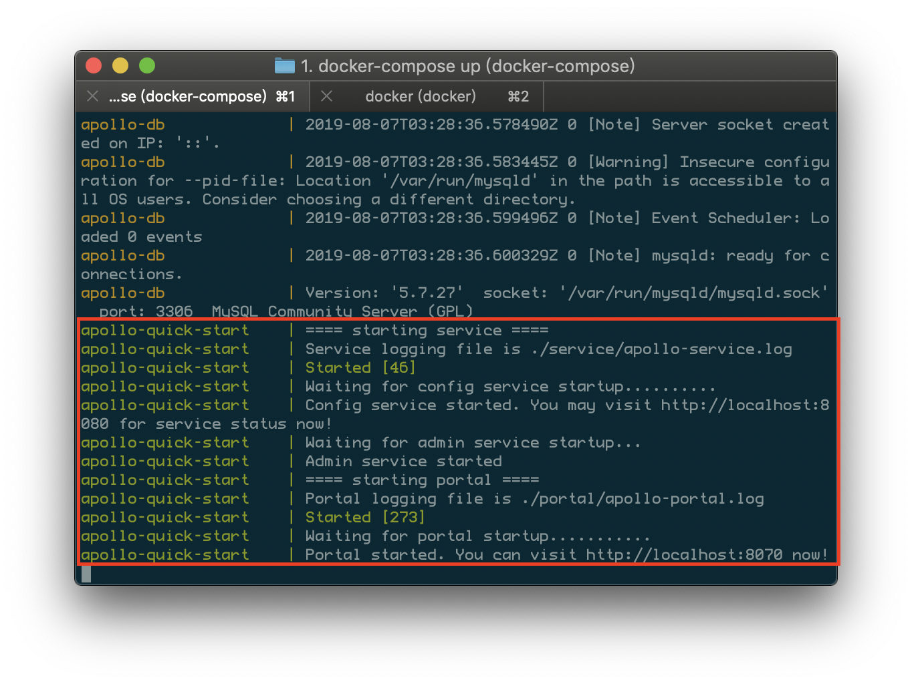
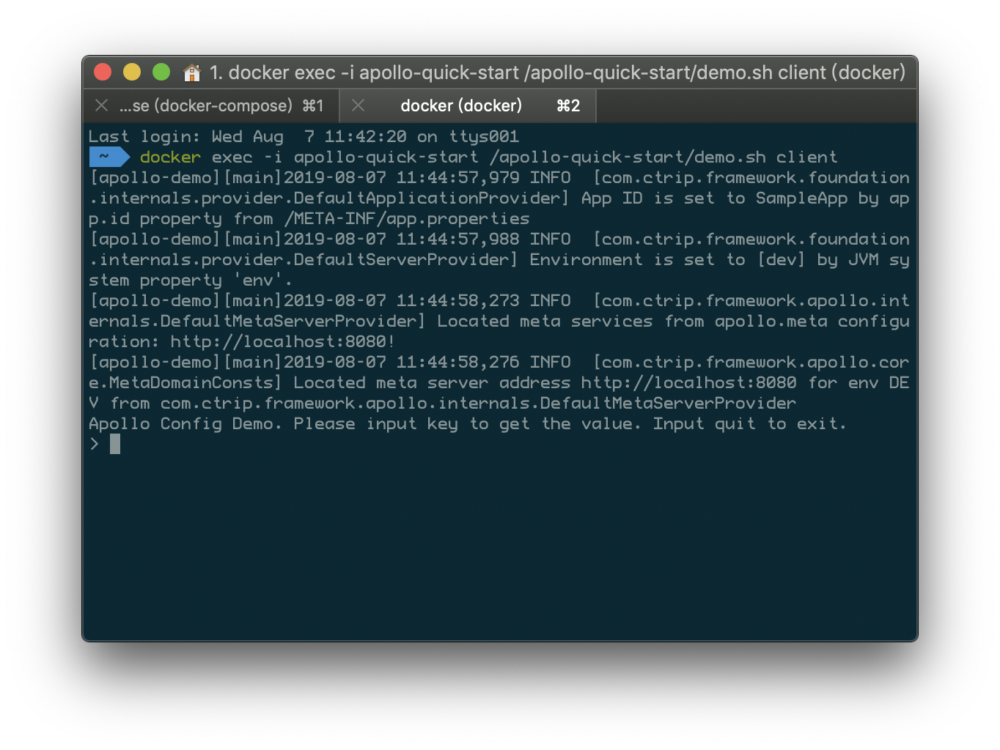

# Docker安装apollo

## 准备工作

1. 下载Docker Quick Start配置文件

   确保[docker-quick-start](https://github.com/ctripcorp/apollo/tree/master/scripts/docker-quick-start)文件夹已经在本地存在，如果本地已经clone过Apollo的代码，则可以跳过此步骤

## 启动Apollo配置中心

1. 在docker-quick-start目录下执行

   ```bash
   docker-compose up
   ```

   

   - 第一次执行会触发下载镜像等操作，需要耐心等待一些时间。

   

   - 数据库的端口映射为13306，所以如果希望在宿主机上访问数据库，可以通过localhost:13306，用户名是root，密码留空。
   - 如要查看更多服务的日志，可以通过`docker exec -it apollo-quick-start bash`登录， 然后到`/apollo-quick-start/service`和`/apollo-quick-start/portal`下查看日志信息。

2. 启动

   ```bash
   docker exec -i apollo-quick-start /apollo-quick-start/demo.sh client
   ```

   

### 查看样例配置

1. 打开[http://localhost:8070](http://localhost:8070/)
2. 输入用户名apollo，密码admin后登录

