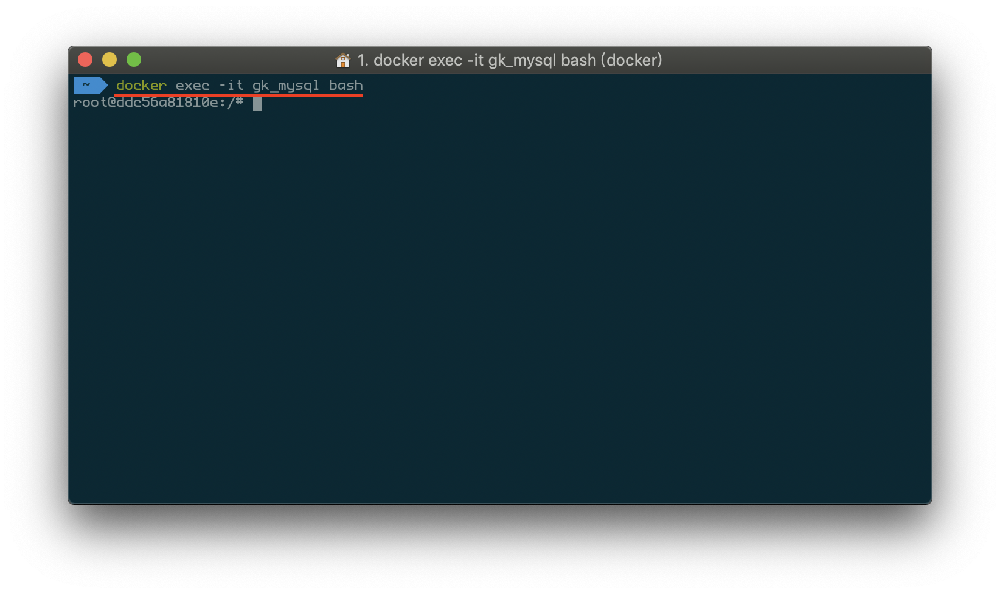
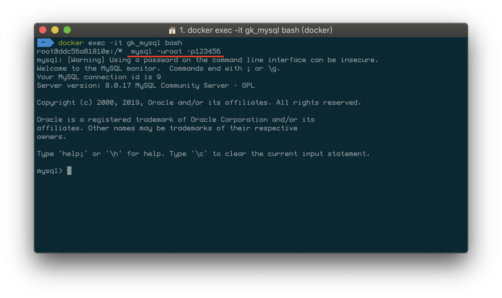
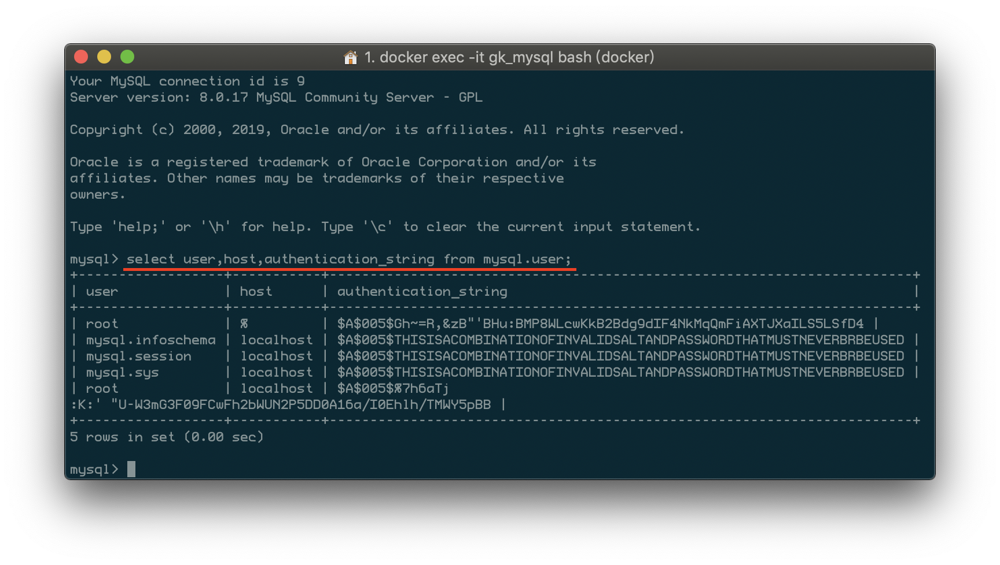
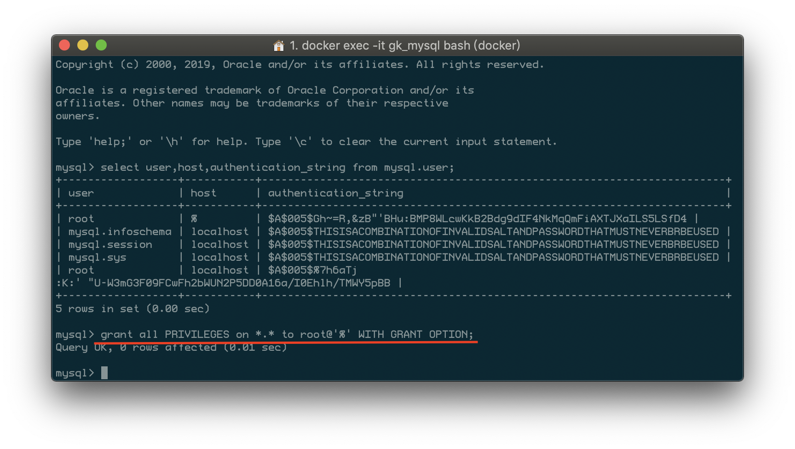
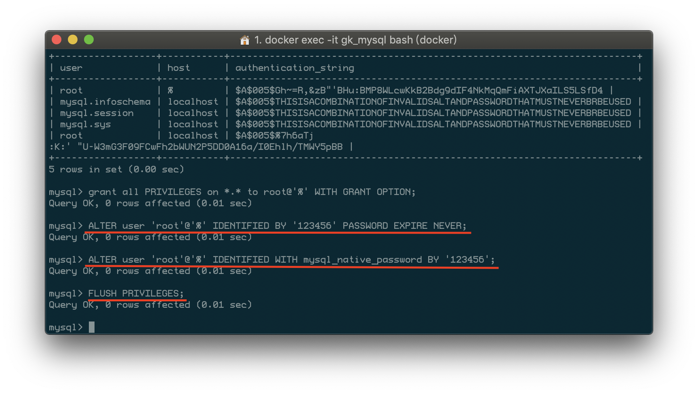

# Docker部署mysql8

<!-- @import "[TOC]" {cmd="toc" depthFrom=2 depthTo=6 orderedList=false} -->
<!-- code_chunk_output -->


<!-- /code_chunk_output -->

1. 创建mysql容器：gk_mysql
```bash
docker run -it --rm --name gk_mysql -e MYSQL_ROOT_PASSWORD=123456 -p 3306:3306 -d mysql:latest
```
2. 进入my_mysql容器：
```bash
docker exec -it gk_mysql bash
```

3. 在容器内登录mysql
```sql
mysql -uroot -p123456
```

4. 查看root等用户信息
```sql
select user,host,authentication_string from mysql.user;
```

5. 为root分配权限，以便可以远程连接
```sql
grant all PRIVILEGES on *.* to root@'%' WITH GRANT OPTION;
```

6. 更新密码算法
```sql
ALTER user 'root'@'%' IDENTIFIED BY '123456' PASSWORD EXPIRE NEVER;
ALTER user 'root'@'%' IDENTIFIED WITH mysql_native_password BY '123456';
FLUSH PRIVILEGES;
```

