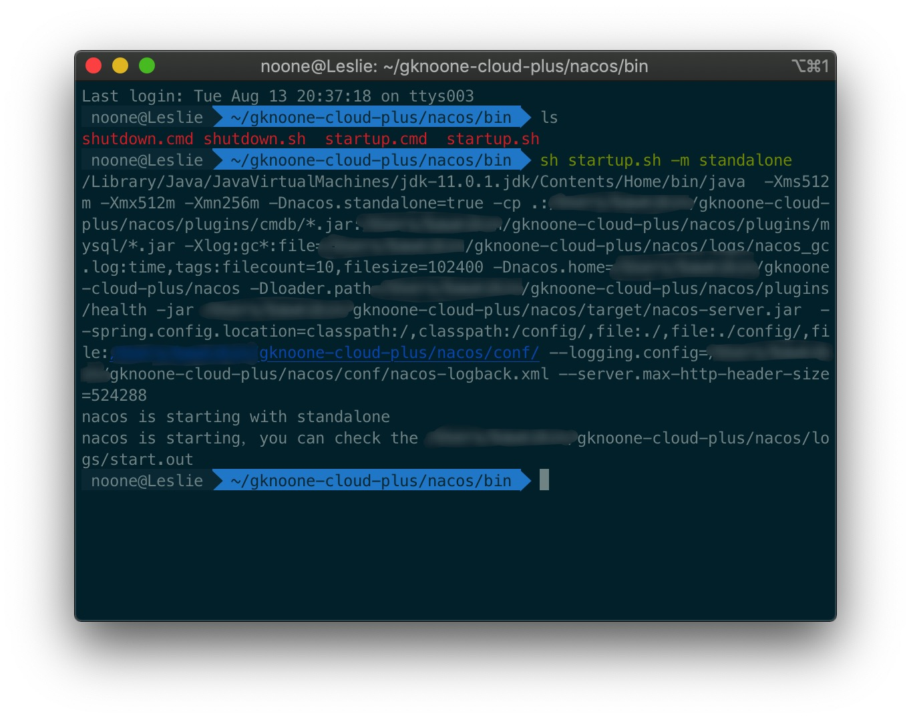

# Nacos安装与启动

下载最新的Nacos[最新稳定版本](https://github.com/alibaba/nacos/releases) 

```bash
unzip nacos-server-$version.zip 或者 tar -xvf nacos-server-$version.tar.gz
cd nacos/bin
```

启动

```bash
sh startup.sh -m standalone
```



访问[http://localhost:8848/nacos/#/welcome](http://localhost:8848/nacos/#/welcome)